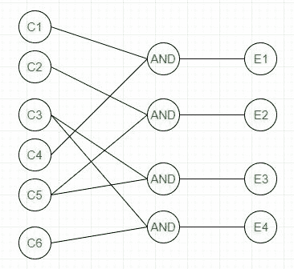

# 软件工程|黑盒测试

> 原文:[https://www . geesforgeks . org/software-engineering-black-box-testing/](https://www.geeksforgeeks.org/software-engineering-black-box-testing/)

先决条件–[软件测试|基础知识](https://www.geeksforgeeks.org/software-testing-basics/)
黑盒测试是一种软件测试，其中软件的功能是未知的。测试是在没有产品内部知识的情况下进行的。

黑盒测试可以通过以下方式完成:

**1。语法驱动测试–**这种类型的测试适用于可以用某种语言进行语法表示的系统。例如编译器，一种可以用上下文无关的语法来表示的语言。在这种情况下，生成测试用例，以便每个语法规则至少使用一次。

**2。等价划分–**通常可以看到，许多类型的输入工作方式类似，因此我们可以将它们组合在一起，并且只测试每组中的一个输入，而不是分别给出所有的输入。其思想是将系统的输入域划分为多个等价类，这样类的每个成员都以相似的方式工作，即如果一个类中的测试用例导致了一些错误，那么类的其他成员也会导致相同的错误。

该技术包括两个步骤:

1.  **等价类的识别–**将任意输入域划分为至少两组:**有效值**和**无效值**。例如，如果有效范围是 0 到 100，则选择一个有效输入，如 49，一个无效输入，如 104。
2.  **Generating test cases –**

    (I)为每个有效和无效的输入类别分配唯一的标识号。
    (ii)考虑到没有两个无效输入相互屏蔽，编写覆盖所有有效和无效测试用例的测试用例。

    为了计算一个数的平方根，等价类将是:
    **(a)有效输入:**

    *   完美平方输出的整数将是整数。
    *   不是完美平方输出的整数将是十进制数。
    *   正小数

    **(b)无效输入:**

    *   负数(整数或十进制)。
    *   除数字外的字符，如“a”和“！”,";"等等。

**3。边界值分析–**边界是错误发生的好地方。因此，如果测试用例是为输入域的边界值设计的，那么测试的效率会提高，发现错误的概率也会增加。例如–如果有效范围是 10 到 100，那么除了有效和无效输入之外，还要测试 10，100。

**4。因果图–**该技术在称为原因的逻辑输入和称为效果的相应动作之间建立关系。原因和影响用布尔图形表示。遵循以下步骤:

1.  识别输入(原因)和输出(效果)。
2.  制作因果图。
3.  将图形转换成决策表。
4.  将决策表规则转换为测试用例。

例如，在下面的因果图中:

它可以转换成决策表，如:

每一列对应一个规则，该规则将成为测试的测试用例。所以会有 4 个测试用例。

**5。基于需求的测试–**它包括验证软件系统的安全需求报告中给出的需求。

**6。兼容性测试–**测试用例结果不仅取决于产品，还取决于交付功能的基础设施。当基础设施参数发生变化时，仍然可以正常工作。通常影响软件兼容性的一些参数有:

1.  处理器(奔腾 3、奔腾 4)和处理器数量。
2.  机器的结构和特征(32 位或 64 位)。
3.  后端组件，如数据库服务器。
4.  操作系统(Windows、Linux 等)。