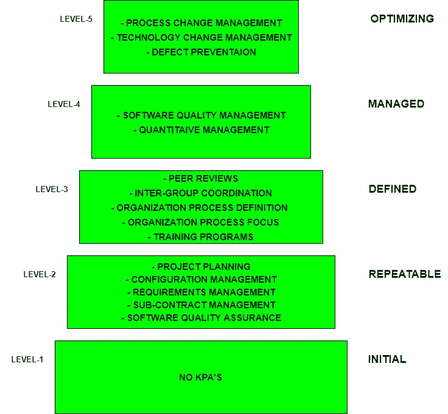

# 软件工程|能力成熟度模型(CMM)

> 原文:[https://www . geesforgeks . org/软件-工程-能力-成熟度-模型-cmm/](https://www.geeksforgeeks.org/software-engineering-capability-maturity-model-cmm/)

CMM 是由卡内基梅隆大学软件工程研究所(SEI)于 1987 年开发的。

*   它不是一个软件过程模型。它是一个框架，用于分析任何组织开发软件产品所遵循的方法和技术。
*   它还提供了进一步提高用于开发这些软件产品的过程的成熟度的指导方针。
*   它基于全球最成功的组织所采用的深刻反馈和开发实践。
*   这个模型描述了一个软件过程改进的策略，它应该遵循 5 个不同的层次。
*   每个成熟度级别都显示了一个过程能力级别。除 1 级以外的所有级别由关键过程区域进一步描述。

**SEI/CMM 的缺点:**

*   在某些情况下，它通过取代真正的使命来鼓励实现更高的成熟度水平，真正的使命是改进过程和整体软件质量。
*   只有在软件开发过程的早期，它才有帮助。
*   它没有正式的理论基础，事实上是基于非常有知识的人的经验。
*   它没有很好的经验支持，同样的经验支持也可以用来支持其他模型。

**关键过程领域(KPA):**
这些 KPA 中的每一个都定义了软件过程应该满足的基本要求，以便满足 KPA 并达到该成熟度水平。

从概念上来说，关键过程领域构成了软件项目管理控制的基础，并建立了一个应用技术方法的环境，如模型、文档、数据、报告等工作产品。产生，建立里程碑，保证质量，适当管理变更。

坐标测量机的 5 个级别如下:

**一级:初始–**

*   没有定义人民军。
*   遵循的流程是临时的和不成熟的，没有很好的定义。
*   软件开发的不稳定环境。
*   没有预测产品质量、完成时间等的依据。

**2 级:可重复–**

*   专注于建立基本的项目管理政策。
*   早期项目的经验用于管理新的类似性质的项目。
*   **项目规划-** 包括定义所需资源、目标、约束等。为了这个项目。它提供了一个详细的计划，为了成功完成高质量的软件，系统地遵循这个计划。
*   **配置管理-** 重点是在整个生命周期内保持软件产品的性能，包括其所有组件。
*   **需求管理-** 包括导致需求集发生一些变化的客户评审和反馈的管理。它还包括适应这些修改后的要求。
*   **分包管理-** 侧重于对合格软件承包商的有效管理，即管理软件中由第三方开发的部分。
*   **软件质量保证-** 它通过在开发时遵循一定的规则和质量标准指南来保证一个好的软件产品质量。

**级别-3:已定义–**

*   在这一级，对标准指南和程序进行记录。
*   它是一套定义明确的集成的特定于项目的软件工程和管理流程。
*   **同行评审-** 在这种方法中，通过使用许多评审方法，如巡查、检查、伙伴检查等，来消除缺陷。
*   **组间协调-** 它由不同开发团队之间有计划的互动组成，以确保有效和适当地满足客户需求。
*   **组织过程定义-** 其重点是标准开发过程的开发和维护。
*   **组织过程焦点-** 它包括为提高组织的过程能力而应遵循的活动和实践。
*   **培训项目-** 重点是提高包括开发人员在内的团队成员的知识和技能，确保工作效率的提高。

**四级:托管–**

*   在这个阶段，为软件产品和软件过程的组织设定了量化的质量目标。
*   所进行的测量有助于组织预测定量定义的某些限度内的产品和过程质量。
*   **软件质量管理-** 包括制定计划和策略，对产品质量进行量化分析和理解。
*   **量化管理-** 侧重于对项目绩效进行量化控制。

**第 5 级:优化–**

*   这是 CMM 中最高级别的过程成熟度，关注的是组织中使用定量反馈的持续过程改进。
*   使用新的工具、技术和软件过程的评估是为了防止已知缺陷的再次发生。
*   **过程变更管理-** 其重点是持续改进组织的软件过程，以提高软件产品的生产率、质量和周期时间。
*   **技术变更管理-** 它包括识别和使用新技术来提高产品质量和缩短产品开发时间。
*   **缺陷预防-** 它侧重于识别缺陷的原因，并通过改进项目定义的流程来防止它们在未来的项目中再次出现。