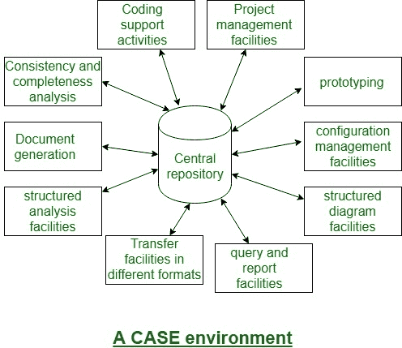

# 软件工程| CASE 工具及其范围

> 原文:[https://www . geesforgeks . org/software-engineering-case-tool-and-it-scope/](https://www.geeksforgeeks.org/software-engineering-case-tool-and-its-scope/)

一个 [CASE(计算机辅助软件包工程)](https://www.geeksforgeeks.org/computer-aided-software-engineering-case/)工具可以是一个通用术语，用来表示对软件包工程的任何类型的机器驱动支持。在一个非常附加的限制意义上，CASE 工具表明任何习惯于自动化一些与软件包开发相关的活动的工具。

可获得的几种 CASE 工具平方度量。这些 CASE 工具中的许多有助于部分相关的任务，如规范、结构化分析、设计、编码、测试等。；以及其他非阶段活动，如项目管理和配置管理。

**使用 CASE 工具的原因:**
使用 CASE 工具的主要原因有:

*   提高生产率
*   为了帮助以更低的价格生产更高质量的代码

**CASE 环境:**
虽然单个 CASE 工具的 square measure 很有帮助，但是一个工具集的真正威力往往只有将这套工具 square measure 集成到一个典型的框架或设置中才能完成。CASE tools square 度量以他们关注的包开发生命周期的一个或多个阶段为特征。由于涵盖不同阶段的完全不同的工具共享公共数据，因此需要它们通过某个中央存储库进行集成，以拥有与包开发工件相关的数据的均匀读取。这个中央存储库有时是信息词典，包含所有复合和基本数据的定义。

通过中央存储库，所有 CASE 工具在一个非常 CASE 的环境中共享它们之间的公共数据。因此，CASE 设置为包开发的分步方法的自动化提供了便利。下图显示了案例设置的示意图:

**注意:** CASE 环境与编程环境不同。

CASE 环境促进了包开发的小阶段方法的自动化。与 CASE 环境不同，编程环境是护理集成工具中的一个助手，它只支持包开发的加密部分。