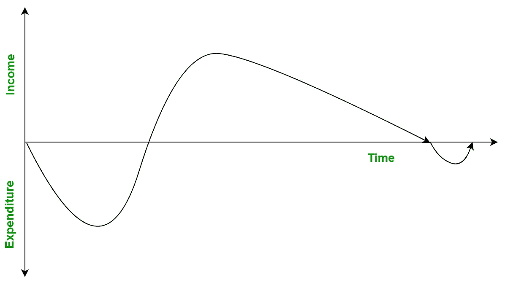

# 软件工程|现金流预测

> 原文:[https://www . geesforgeks . org/软件-工程-现金流-预测/](https://www.geeksforgeeks.org/software-engineering-cash-flow-forecasting/)

**现金流**是资金进出一个组织的运动。它涉及一个组织的支出和收入。

**现金流预测:**
简单来说就是对一段时间内现金流的估计。为了确保项目有足够的资金生存，做现金流预测是很重要的。它给出了在软件项目的生命周期中收入和支出何时发生的估计。必须时不时地这样做，尤其是对于初创企业和小企业。然而，如果企业的现金流更稳定，那么每周或每月预测现金流就足够了。

现金流有两种类型:

*   **正现金流:**
    如果一个组织期望获得的收入多于支出，那么它就被称为正现金流，公司永远不会因为软件项目的完成而资金不足。
*   **负现金流:**
    如果一个组织期望获得的收入少于支出，那么它就被称为负现金流，公司未来完成软件项目的资金将会减少。

现金流预测的重要性:

*   它允许管理层根据未来的收入来计划支出。
*   它帮助组织分析其支出和收入。
*   确保公司有能力支付员工和供应商的工资。
*   有助于财务规划。