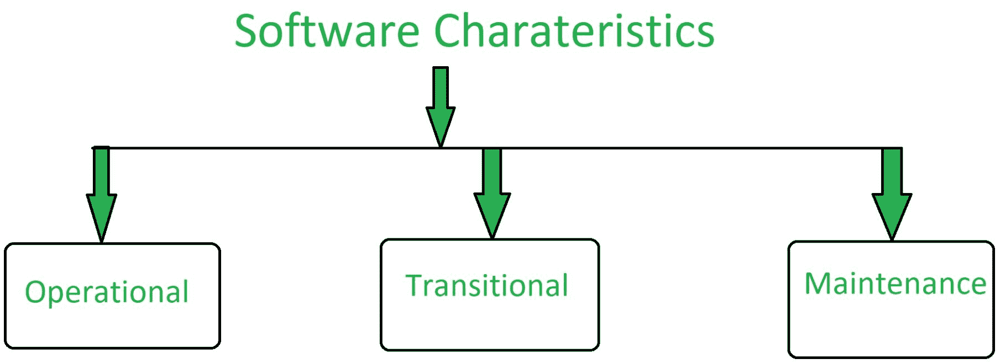

# 软件工程|好软件的特点

> 原文:[https://www . geesforgeks . org/software-engineering-features-of-good-software/](https://www.geeksforgeeks.org/software-engineering-characteristics-of-good-software/)

通过不同的因素，软件被视为一个好的软件。一个软件产品被总结为一个好的软件是因为它提供了什么，以及它能被使用得多好。决定软件属性的因素分为三类:运行、过渡和维护。这些解释如下。

**1。运营:**
在运营类别中，决定运营中软件性能的因素。可以通过以下方式进行测量:

*   预算
*   可用性
*   效率
*   正确性
*   功能
*   可靠性
*   安全
*   安全

**2。过渡:**
当软件从一个平台转移到另一个平台时，决定软件质量的因素有:

*   轻便
*   互用性
*   复用性
*   适应性

**3。维护:**
在这一类别中，包括了描述软件在不断变化的环境中自我维护能力的所有因素:

*   模块性
*   可维护性
*   灵活性
*   可量测性