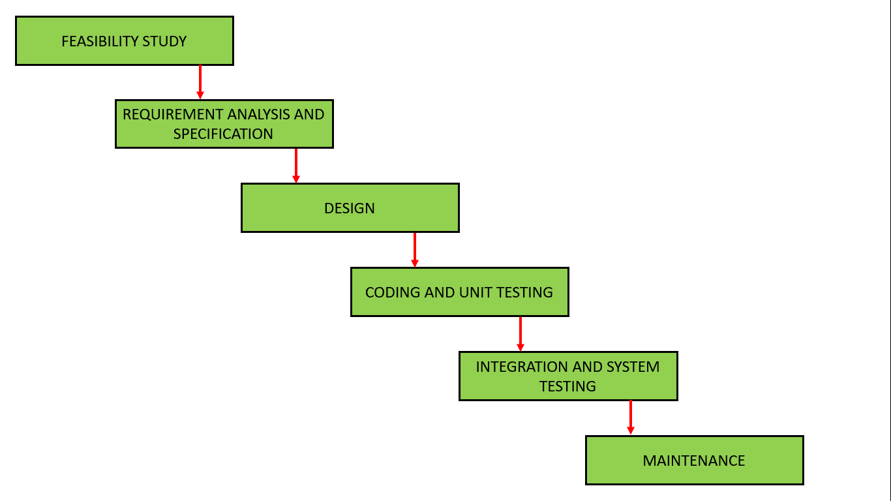

# 软件工程|经典瀑布模型

> 原文:[https://www . geesforgeks . org/软件-工程-经典-瀑布-模型/](https://www.geeksforgeeks.org/software-engineering-classical-waterfall-model/)

经典瀑布模型是基础的**软件开发生命周期**模型。很简单但很理想化。早期这种模式很受欢迎，但现在已经不用了。但是它非常重要，因为所有其他的软件开发生命周期模型都是基于经典的瀑布模型。
经典瀑布模型将生命周期划分为一组阶段。该模型认为一个阶段可以在前一阶段完成后开始。也就是说，一个阶段的输出将是下一个阶段的输入。因此，开发过程可以被认为是瀑布中的连续流程。这里的相位彼此不重叠。经典瀑布模型的不同连续阶段如下图所示:

现在让我们简单详细地了解一下这些阶段:

1.  **可行性研究**:这个阶段的主要目标是确定开发软件在财务和技术上是否可行。
    可行性研究包括了解问题，然后确定解决问题的各种可能策略。根据这些不同的解决方案的优缺点对其进行分析，选择最佳解决方案，所有其他阶段都按照此解决方案策略执行。
2.  **需求分析和规范**:需求分析和规范阶段的目的是了解客户的确切需求，并适当地记录下来。这个阶段包括两个不同的活动。
    *   **需求收集和分析:**首先从客户那里收集关于软件的所有需求，然后对收集到的需求进行分析。分析部分的目标是消除不完整(不完整的需求是指实际需求的某些部分被省略)和不一致(不一致的需求是指需求的某些部分与其他部分相矛盾)。
    *   **需求规格说明:**这些分析的需求被记录在软件需求规格说明(SRS)文档中。SRS 文档作为开发团队和客户之间的合同。客户和开发商之间未来的任何争议都可以通过检查 SRS 文件来解决。
3.  **设计**:设计阶段的目的是将 SRS 文档中指定的需求转换成适合用某种编程语言实现的结构。
4.  **编码和单元测试**:在编码阶段，使用任何合适的编程语言将软件设计翻译成源代码。因此，每个设计的模块都被编码。单元测试阶段的目的是检查每个模块是否正常工作。
5.  **集成和系统测试**:不同模块的集成是在编码和单元测试后不久进行的。各种模块的集成在多个步骤中逐步进行。在每个集成步骤中，将先前计划的模块添加到部分集成的系统中，并对最终系统进行测试。最后，在所有模块成功集成和测试后，得到完整的工作系统，并在此基础上进行系统测试。

系统测试包括三种不同类型的测试活动，如下所述:

*   **Alpha 测试:** Alpha 测试是开发团队进行的系统测试。
*   **Beta 测试:** Beta 测试是由一组友好的客户进行的系统测试。
*   **验收测试:**软件交付后，客户进行验收测试，以确定是接受交付的软件还是拒绝交付的软件。

*   **Maintenance:** Maintenance is the most important phase of a software life cycle. The effort spent on maintenance is the 60% of the total effort spent to develop a full software. There are basically three types of maintenance :
    *   **纠正性维护:**进行这种类型的维护是为了纠正在产品开发阶段没有发现的错误。
    *   **完善的维护:**进行这种类型的维护是为了根据客户的要求增强系统的功能。
    *   **自适应维护:**将软件移植到新的环境中工作，例如在新的计算机平台上工作或使用新的操作系统，通常需要进行自适应维护。

    **经典瀑布模型的优势**

    经典瀑布模型是软件开发的理想模型。很简单，所以可以考虑作为其他软件开发生命周期模型的基础。以下是这种 SDLC 模式的一些主要优势:

    *   这个模型非常简单，容易理解。
    *   该模型中的阶段一次处理一个。
    *   模型中的每个阶段都有明确的定义。
    *   这个模型有非常清晰和被很好理解的里程碑。
    *   过程、行动和结果都有很好的记录。
    *   强化良好习惯:先定义后设计，
        先设计后编码。
    *   这种模式适用于较小的项目和需求很好理解的项目。

    **经典瀑布模型的缺点**

    经典瀑布模型有各种各样的缺点，基本上我们不能在实际项目中使用它，但是我们使用其他基于经典瀑布模型的软件开发生命周期模型。以下是这种模式的一些主要缺点:

    *   **无反馈路径:**在经典瀑布模型中，软件从一个阶段到另一个阶段的演化就像瀑布一样。它假设开发人员在任何阶段都不会犯任何错误。因此，它不包含任何纠错机制。
    *   **难以容纳变更请求:**这个模型假设所有的客户需求都可以在项目开始时完整、正确地定义，但实际上客户的需求会随着时间不断变化。需求规范阶段完成后，很难适应任何变更请求。
    *   **阶段不重叠:**该模型建议新阶段只有在前一阶段完成后才能开始。但在实际项目中，这是无法维持的。为了提高效率和降低成本，阶段可能会重叠。