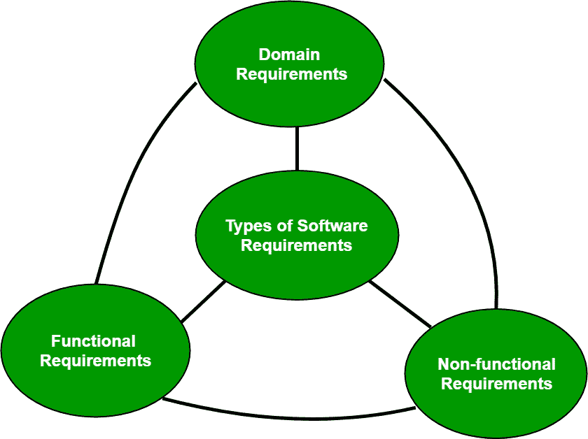

# 软件工程|软件需求分类

> 原文:[https://www . geesforgeks . org/软件工程-软件分类-需求/](https://www.geeksforgeeks.org/software-engineering-classification-of-software-requirements/)

根据 IEEE 标准 729，要求定义如下:

*   用户解决问题或实现目标所需的条件或能力
*   系统或系统组件必须满足或拥有的条件或能力，以满足合同、标准、规范或其他正式强加的文件
*   如 1 和 2 所示的条件或能力的记录表示。

**软件需求可以有 3 种类型:**

*   功能需求
*   非功能性要求
*   领域要求

**功能需求:**这些是最终用户作为系统应该提供的基本设施而特别要求的需求。所有这些功能都必须作为合同的一部分纳入系统。这些以输入给系统、执行的操作和预期的输出的形式表示或陈述。它们基本上是用户陈述的需求，用户可以在最终产品中直接看到这些需求，这与非功能性需求不同。

例如，在医院管理系统中，医生应该能够检索他的病人的信息。每个高级功能需求可能涉及系统和外部世界之间的若干交互或对话。为了准确描述功能需求，必须列举所有场景。

有许多表达功能需求的方式，例如，自然语言、没有严格语法的结构化或格式化语言以及具有适当语法的正式规范语言。

**非功能性需求:**这些基本上是系统根据项目合同必须满足的质量约束。实施这些因素的优先次序或程度因项目而异。它们也被称为非行为需求。
他们主要处理的问题有:

*   轻便
*   安全
*   可维护性
*   可靠性
*   可量测性
*   表演
*   复用性
*   灵活性

NFR 氏症分为以下类型:

*   界面约束
*   性能限制:响应时间、安全性、存储空间等。
*   操作限制
*   生命周期约束:可维护性、可移植性等。
*   经济约束

指定非功能性需求的过程需要系统功能的知识，以及系统运行的环境的知识。

**领域需求:**领域需求是特定项目类别或领域的特征需求。一个特定领域的系统必须展现的基本功能就属于这一类。例如，在维护学校或学院记录的学术软件中，能够访问每个年级的教师列表和学生列表的功能是一个领域要求。因此，这些需求是从该领域模型中确定的，而不是用户特定的。