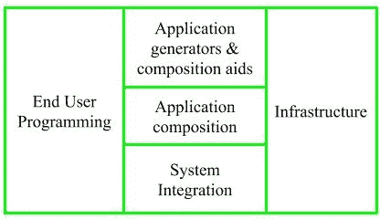
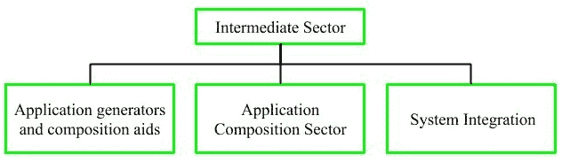
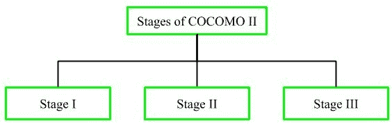

# 软件工程| COCOMO II 模型

> 原文:[https://www . geesforgeks . org/software-engineering-cocomo-ii-model/](https://www.geeksforgeeks.org/software-engineering-cocomo-ii-model/)

**COCOMO-II** 是原[COCOMO(建设性成本模型)](https://www.geeksforgeeks.org/?p=193526)的修订版，由南加州大学开发。当计划一个新的软件开发活动时，这个模型允许人们估计成本、努力和进度。

它由三个子模型组成:

**1。最终用户编程:**
应用程序生成器用于该子模型。最终用户通过使用这些应用程序生成器来编写代码。
**示例–**电子表格、报告生成器等。

**2。中间扇区:**

*   **(一)。应用程序生成器和合成辅助工具–**
    这个类别将为用户编程创建大量预打包的功能。他们的产品将有许多可重复使用的组件。在这一领域运营的典型公司有微软、Lotus、
    甲骨文、IBM、博兰、Novell。
*   **(b)。应用组合部门–**
    这一类别过于多样化，无法通过预打包解决方案来处理。它包括图形用户界面、数据库、领域特定组件，如金融、医疗或工业过程控制包。
*   **(c)。系统集成–**
    该类别涉及大规模和高度嵌入式系统。

**3。基础设施部门:**
该类别为操作系统、数据库管理系统、用户界面管理系统、网络系统等软件开发提供基础设施。

**COCOMO II 的阶段:**

1.  **阶段一:**
    支持原型估算。为此，它使用*应用程序组成估计模型*。该模型用于应用生成器和系统集成的原型阶段。
2.  **阶段-II:**
    支持项目前期设计阶段的估算，当时我们对它了解的比较少。为此，它使用*早期设计评估模型*。该模型用于应用生成器、基础设施、系统集成的早期设计阶段。
3.  **阶段-三:**
    支持项目后架构阶段的估算。为此，它使用*后架构评估模型*。该模型用于完成应用生成器、基础设施、系统集成的详细架构后。