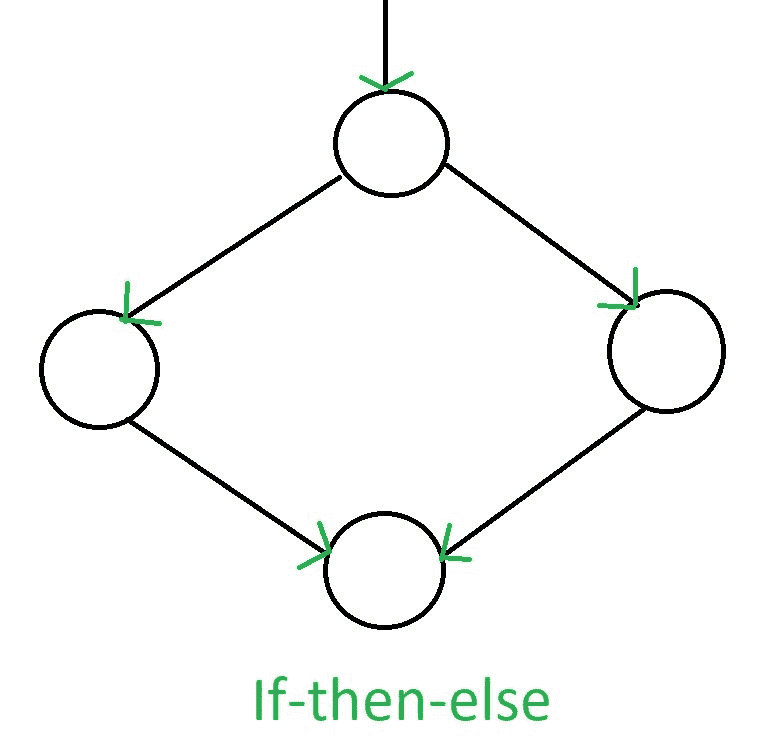
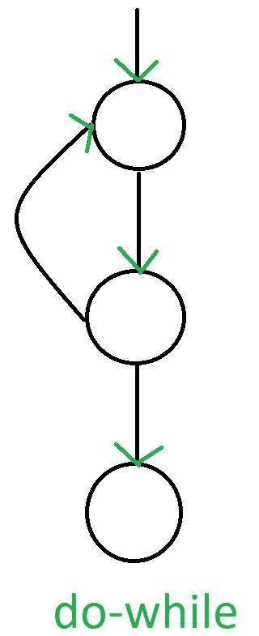
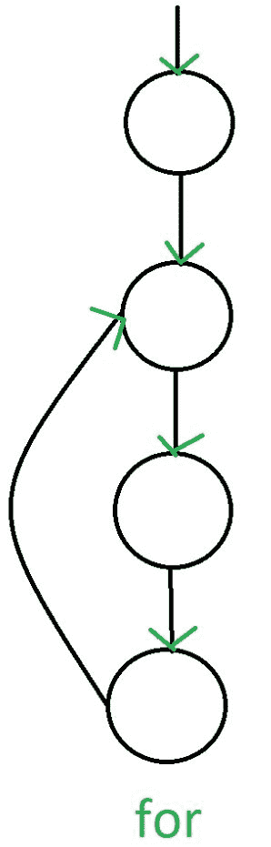
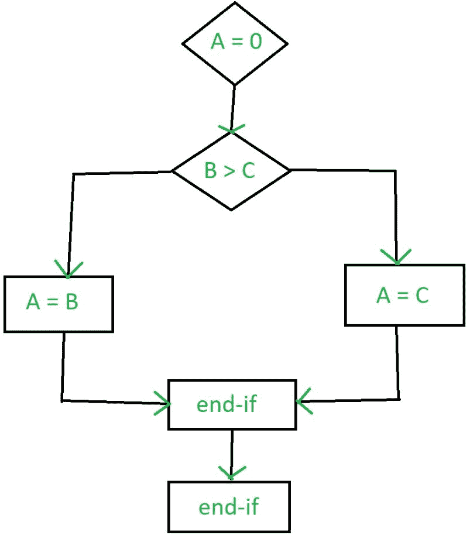
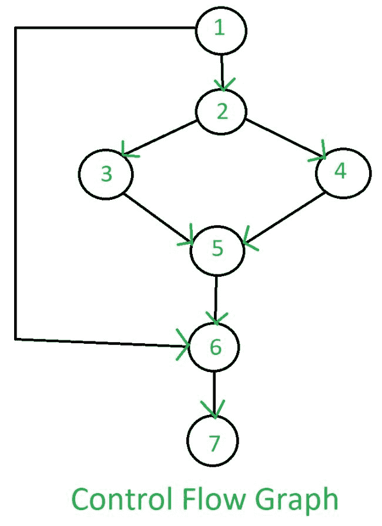

# 软件工程|控制流图(CFG)

> 原文:[https://www . geesforgeks . org/software-engineering-control-flow-graph-CFG/](https://www.geeksforgeeks.org/software-engineering-control-flow-graph-cfg/)

一个**控制流图(CFG)** 是程序或应用程序执行期间控制流或[计算的图形表示。控制流图主要用于静态分析以及编译器应用程序，因为它们可以准确地表示程序单元内部的流。控制流程图最初由*法兰西斯·E·艾伦*开发。](https://www.geeksforgeeks.org/cyclomatic-complexity/)

**控制流程图特征:**

*   控制流程图是面向过程的。
*   控制流图显示了程序执行过程中可以遍历的所有路径。
*   控制流图是有向图。
*   CFG 中的边描述控制流路径，CFG 中的节点描述基本块。

控制流图中有两个指定的块:

1.  **入口块:**
    入口块允许控制进入控制流程图。
2.  **出口街区:**
    控制流通过出口街区离开。

因此，控制流程图由流程图中涉及的所有构建块组成，例如开始节点、结束节点和节点之间的流程。

**一般控制流图:**
控制流图对于所有语句和循环都有不同的表示。以下图片描述了它:

1. **If-else:**



2.**而:**


3. **do-while:**



4.**为:**



**示例:**

```
if  A = 10 then
  if B > C
     A = B
  else A = C
  endif
  endif
print A, B, C 
```

上述示例的流程图将是:



上述示例的控制流程图为:



**CFG 的优势:**
控制流图有很多优势。它可以很容易地封装每个基本块的信息。它可以很容易地定位程序中不可访问的代码，并且在控制流图中很容易找到诸如循环这样的语法结构。