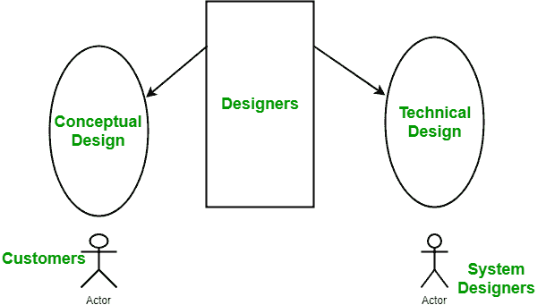
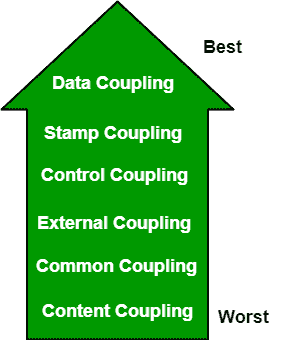
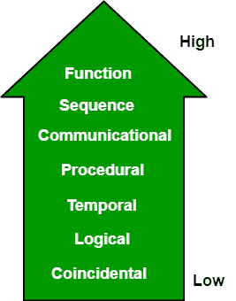

# 软件工程|耦合和内聚

> 原文:[https://www . geesforgeks . org/software-engineering-coupling-and-cohesion/](https://www.geeksforgeeks.org/software-engineering-coupling-and-cohesion/)

**简介:**软件开发生命周期中设计阶段的目的是针对 SRS(软件需求规格说明)文档中给出的问题提出解决方案。设计阶段的输出是软件设计文档(SDD)。

基本上，设计是一个两部分的迭代过程。第一部分是概念设计，它告诉客户系统将做什么。其次是技术设计，它允许系统构建者了解解决客户问题所需的实际硬件和软件。

**系统** **概念设计:**

*   用简单的语言编写，即客户可以理解的语言。
*   系统特性的详细说明。
*   描述系统的功能。
*   它独立于实现。
*   与需求文档链接。

**系统技术设计:**

*   硬件组件和设计。
*   软件组件的功能和层次结构。
*   软件体系结构
*   网络体系结构
*   数据结构和数据流。
*   系统的输入输出组件。
*   显示界面。

**模块化:**模块化是将软件系统划分为多个独立模块的过程，其中每个模块独立工作。模块化在软件工程中有很多优点。其中一些如下:

*   系统简单易懂。
*   系统维护很容易。
*   一个模块可以根据他们的要求多次使用。不需要反复写。

**耦合:**耦合是模块之间相互依赖程度的度量。一个好的软件会有低耦合。

**联轴器类型:**

*   **数据耦合:**如果模块之间的依赖关系是基于它们只通过传递数据进行通信的事实，那么模块就被称为数据耦合。在数据耦合中，组件相互独立，并通过数据进行通信。模块通信不包含不定期数据。示例-客户计费系统。
*   **戳耦合**在戳耦合中，完整的数据结构从一个模块传递到另一个模块。因此，它涉及不定期数据。由于效率因素，这可能是必要的——这个选择是由有洞察力的设计师做出的，而不是一个懒惰的程序员。
*   **控制耦合:**如果模块通过传递控制信息进行通信，则称它们为控制耦合。如果参数指示完全不同的行为，这可能是不好的；如果参数允许分解和重用功能，这可能是好的。以比较函数为参数的排序函数。
*   **外部耦合:**在外部耦合中，模块依赖于正在开发的软件或特定类型的硬件之外的其他模块。Ex 协议、外部文件、设备格式等。
*   **公共耦合:**各模块具有全局数据结构等共享数据。全局数据的变化意味着追溯到所有访问该数据的模块，以评估变化的影响。因此，它存在模块重用困难、控制数据访问能力降低、可维护性降低等缺点。
*   **内容耦合:**在内容耦合中，一个模块可以修改另一个模块的数据，或者控制流从一个模块传递到另一个模块。这是最糟糕的耦合形式，应该避免。

**内聚性:**内聚性是模块的元素在功能上相关程度的度量。它是指向执行单一任务的所有元素包含在组件中的程度。基本上，内聚力是保持模块在一起的内在粘合剂。一个好的软件设计会有很高的凝聚力。

**衔接类型:**

*   **功能内聚性:**单个计算的每个基本元素都包含在组件中。功能内聚执行任务和功能。这是一个理想的情况。
*   **顺序内聚:**一个元素输出一些数据，这些数据成为其他元素的输入，即部件之间的数据流。它自然出现在函数式编程语言中。
*   **通信内聚性:**两个元素对相同的输入数据进行操作或者对相同的输出数据做出贡献。示例-更新数据库中的记录并将其发送到打印机。
*   **程序衔接:**程序衔接的要素保证了执行的顺序。动作仍然是弱连接的，不太可能被重用。Ex 计算学生 GPA，打印学生记录，计算累计 GPA，打印累计 GPA。
*   **时间内聚力:**元素通过它们所涉及的时间来关联。一个与时间内聚性相联系的模块所有的任务必须在相同的时间跨度内执行。这种凝聚力包含了初始化系统所有部分的代码。许多不同的活动都发生在单位时间。
*   **逻辑衔接:**各要素逻辑相关，功能无关。Ex- A 组件从磁带、磁盘和网络读取输入。这些函数的所有代码都在同一个组件中。操作是相关的，但是功能有很大的不同。
*   **巧合衔接:**各要素不相关(不相关)。这些元素除了在源代码中的位置之外，没有任何概念关系。这是偶然的，也是最糟糕的凝聚形式。在单个组件中打印下一行并反转字符串的字符。