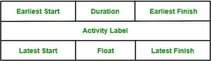
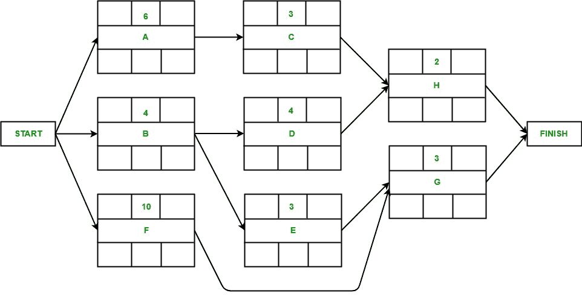
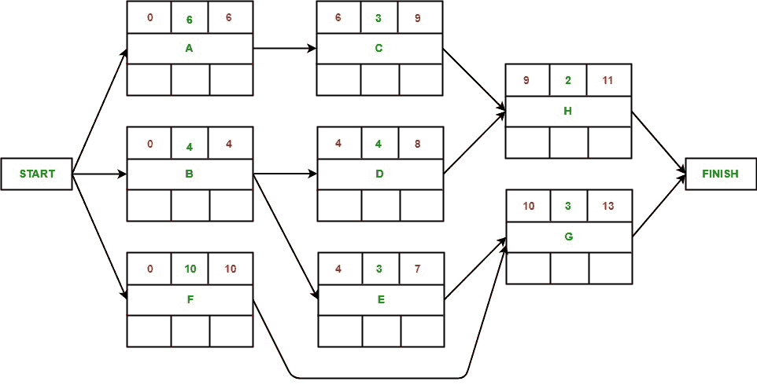
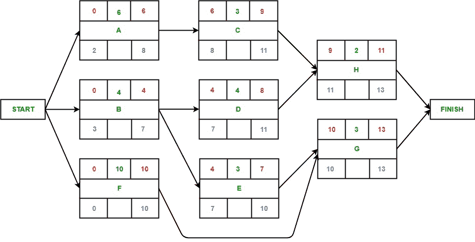
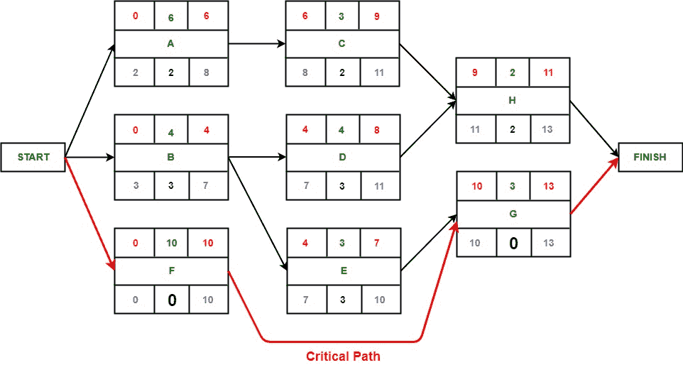

# 软件工程|关键路径法

> 原文:[https://www . geesforgeks . org/software-engineering-critical-path-method/](https://www.geeksforgeeks.org/software-engineering-critical-path-method/)

关键路径法(CPM)是项目计划中使用的一种方法，通常用于项目调度，以按时完成项目。它实际上有助于确定整个项目能够完成的最早时间。该方法主要有两个概念，即关键任务和关键路径。**关键任务**是不能拖延的任务/活动，否则会耽误整个项目的完成。在开始其他相关任务之前，必须按时完成。

**关键路径**是关键任务/活动的序列，是项目网络中最大的路径。它给了我们完成整个项目所需的最短时间。关键路径中的活动被称为关键活动，如果这些活动被延迟，那么整个项目的完成也会被延迟。

**关键路径法的主要步骤:**

1.  确定活动
2.  构建项目网络
3.  使用向前和向后传递执行时间估计
4.  确定关键路径

下表包含活动标签、其各自的持续时间(以周为单位)及其先例。我们将使用关键路径方法来找到这个项目的关键路径和活动。

| 活动 | 持续时间(周) | 引用单元 |
| --- | --- | --- |
| A | six | – |
| B | four | – |
| C | three | A |
| D | four | B |
| E | three | B |
| F | Ten | – |
| G | three | 英、法 |
| H | Two | 丙、丁 |

**节点活动网络图设计规则:**

*   项目网络应该只有一个开始节点
*   项目网络应该只有一个端节点
*   节点有一个持续时间
*   链接通常没有持续时间
*   “先例”是紧接在前面的活动
*   时间在项目网络中从左向右移动
*   网络不应包含环路
*   网络不应包含悬挂物

**节点表示:**

*   **活动标签**是该节点代表的活动名称。
*   **最早开始**是活动最早可以开始的日期或时间。
*   **最早完成**是活动最早可以完成的日期或时间。
*   **最晚开始**是活动最晚可以开始的日期或时间。
*   **最晚完成**是活动最晚可以完成的日期或时间。
*   **Float** 等于最早开始和最晚开始或最早完成和最晚完成的差值。

**节点上活动图:**

**向前传递:**
向前传递是为了计算每个活动可能开始和完成的最早日期。

1.  活动 A 可能会立即开始。因此，其最早开始日期为零，即 ES(A) = 0。完成执行需要 6 周时间。因此，它能完成的最早时间是第 6 周，即 EF(A) = 6。
2.  活动 B 可能会立即开始。因此，其最早开始日期为零，即 ES(B) = 0。完成执行需要 4 周时间。因此，它能完成的最早时间是第 4 周，即 EF(B) = 4。
3.  活动 F 可能会立即开始。因此，其最早开始日期为零，即 ES(F) = 0。完成执行需要 10 周。因此，它能完成的最早时间是第 10 周，即 EF(F) = 10。
4.  一旦活动 A 完成执行，活动 C 就开始。因此，它可以开始执行的最早一周是第 6 周，即 ES(C) = 6。完成执行需要 3 周时间。因此，它能完成的最早时间是第 9 周，即 EF(C) = 9。
5.  一旦活动 B 完成执行，活动 D 就开始。因此，它可以开始执行的最早一周是第 4 周，即 ES(D) = 4。完成执行需要 4 周时间。因此，它能完成的最早时间是第 8 周，即 EF(D) = 8。
6.  一旦活动 B 完成执行，活动 E 就开始。因此，它可以开始执行的最早一周是第 4 周，即 ES(E) = 4。完成执行需要 3 周时间。因此，它能完成的最早时间是第 7 周，即 EF(E) = 7。
7.  一旦活动 E 和活动 F 完成执行，活动 G 就开始了。因为活动需要完成这两项才能开始执行，所以我们会考虑 MAX(ES(E)，ES(F))。因此，它可以开始执行的最早一周是第 10 周，即 ES(G) = 10。完成执行需要 3 周时间。因此，它能完成的最早时间是第 13 周，即 EF(G) = 13。
8.  一旦活动 C 和活动 D 完成执行，活动 H 就会开始。因为活动需要完成这两项才能开始执行，所以我们会考虑 MAX(ES(C)，ES(D))。因此，它可以开始执行的最早一周是第 9 周，即 ES(H) = 9。完成执行需要 2 周时间。因此，它能完成的最早时间是第 11 周，即 EF(H) = 11。

**倒推法:**
倒推法是在不延迟项目结束日期的情况下，计算每项活动可能开始和结束的最晚日期。
假设:最晚完成日期=最早完成日期(项目)。

1.  根据假设，即 LF(G) = 13，活动 G 的最晚完成日期等于前一个完成活动的最早完成日期。完成执行需要 3 周时间。因此，最晚可以从第 10 周开始，即 LS(G) = 10。
2.  根据假设，活动 H 的最晚完成日期等于前一个完成活动的最早完成日期，即 LF(H) = 13。完成执行需要 2 周时间。因此，最晚可以从第 11 周开始，即 LS(H) = 11。
3.  活动 C 的最晚结束日期是 H 的最晚开始日期，即 LF(C) = 11。完成执行需要 3 周时间。因此，最晚的开始时间是第 8 周，即 LS(C) = 8。
4.  活动 D 的最晚结束日期是 H 的最晚开始日期，即 LF(D) = 11。完成执行需要 4 周时间。因此，最晚的开始时间是第 7 周，即 LS(D) = 7。
5.  活动 E 的最晚结束日期将是 G 的最晚开始日期，即 LF(G) = 10。完成执行需要 3 周时间。因此，最晚的开始时间是第 7 周，即 LS(E) = 7。
6.  活动 F 的最晚结束日期将是 G 的最晚开始日期，即 LF(G) = 10。完成执行需要 10 周。因此，它最晚可以从第 0 周开始，即 LS(F) = 0。
7.  活动 A 的最晚结束日期将是 C 的最晚开始日期，即 LF(A) = 8。完成执行需要 6 周时间。因此，最晚的开始时间是第 2 周，即 LS(A) = 2。
8.  The latest end date for activity B would be the earliest of the latest start date of D and E i.e. LF(B) = 7\. It takes 4 weeks to complete its execution. Hence, latest it can start is week 3 i.e. LS(B) = 3.

    

    **识别关键路径:**
    关键路径是给我们或帮助我们估计整个项目最早可以完成的时间的路径。这条关键路径上的活动的任何延迟都将导致整个项目的完成延迟。为了确定关键路径，我们需要计算每个活动的活动浮动。

    活动浮动实际上是活动的最早开始日期和最晚开始日期之间的差异，或者活动的最早完成日期和最晚完成日期之间的差异，它表示在不延迟整个项目完成的情况下，活动可以延迟多少时间。如果活动的浮动为零，则该活动是关键活动，必须添加到项目网络的关键路径中。在本例中，活动 F 和 G 的浮动为零，因此是关键活动。

    