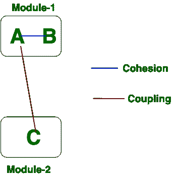

# 软件工程|耦合和内聚的区别

> 原文:[https://www . geesforgeks . org/software-engineering-differences-in-coupling-and-cohesion/](https://www.geeksforgeeks.org/software-engineering-differences-between-coupling-and-cohesion/)

先决条件–[耦合和内聚](https://www.geeksforgeeks.org/software-engineering-coupling-and-cohesion/)
**内聚:**
内聚是模块内关系的指示。这是模块内的概念。内聚有很多类型，但是通常高度内聚对软件是有好处的。

**耦合:**
耦合也是模块之间关系的指示。这是模块间的概念。耦合也有很多类型，但通常低耦合对软件来说是好的。

现在我们将看到内聚性和耦合性之间的区别。内聚性和耦合性的区别如下:

| 内聚力 | 连接 |
| 内聚是模块内的概念。 | 耦合是模块间的概念。 |
| 内聚性代表模块内的关系。 | 耦合表示模块之间的关系。 |
| 增加内聚性对软件是有好处的。 | 软件避免增加耦合。 |
| 内聚性代表模块的功能强度。 | 耦合代表模块之间的独立性。 |
| 高度的内聚性给出了最好的软件。 | 松散耦合是最好的软件。 |
| 在内聚性中，模块关注单一的事物。 | 在耦合中，模块连接到其他模块。 |

