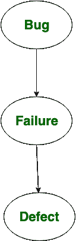

# 软件工程|缺陷、bug 和故障的区别

> 原文:[https://www . geesforgeks . org/software-engineering-default-bug-and-failure 之间的差异/](https://www.geeksforgeeks.org/software-engineering-differences-between-defect-bug-and-failure/)

通常，当系统/应用程序没有按照预期或异常运行时，我们称之为错误或故障等等。软件测试行业的许多新手在使用这个时都有困惑，那么让我们知道 b/w 缺陷、bug、错误和失败的区别是什么。我们将一个一个详细地看这些术语。

1.  **Defect:**

    > 程序员在代码中引入的错误被称为缺陷。

    缺陷被定义为与应用程序或软件的实际和预期结果的偏差，或者换句话说，缺陷被定义为与产品功能规范文件中提到的规范的任何偏差或不规则性。缺陷也由开发人员在开发阶段或阶段解决。

    **缺陷原因:**

    *   任何偏离客户要求的行为都被称为缺陷。
    *   通过给出错误的输入可能导致缺陷。
    *   逻辑代码中的任何错误都可能导致缺陷。
2.  **Bug:**
    Sometimes most people are confused between defect and bug, they say that bug is the informal name of defect. Actually bugs are faults in system or application which impact on software functionality and performance. Usually bugs are found in unit testing by testers.

    有不同类型的 bug，下面给出了其中一些。

    *   功能错误
    *   编译错误
    *   缺少命令
    *   运行时错误
    *   逻辑错误
    *   错误处理不当

    以上给出的这些错误导致 bug。

3.  **Failure:**

    > 当缺陷到达最终客户时，称为故障。

    一旦产品完成并交付给客户，如果客户在产品或软件中发现任何问题，那么这就是产品故障的情况。
    换句话说，如果最终用户在产品中发现问题，那么该特定问题被称为故障。

    **故障原因:**

    *   人为错误或失误可能导致失败。
    *   环境条件
    *   系统的使用方式。

**缺陷 Bug 流向:**



**例:**
举个例子看看缺陷。

```
a=7
b=5
ans=a*b
print("Addition of {} and {} = {}.".format(a, b, ans)) 
```

当您编译并运行该程序时，您会看到如下打印的语句:

```
Addition of 7 and 5=35 
```

这是一个两个数相加的程序，但输出结果与实际结果 12 有偏差。现在我们检测到一个故障。当检测到故障时，可能会出现缺陷。