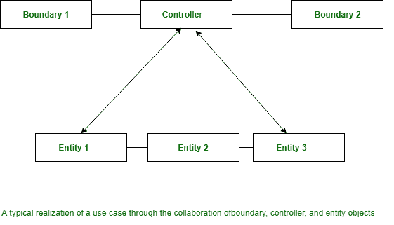

# 软件工程|领域建模

> 原文:[https://www . geesforgeks . org/software-engineering-domain-modeling/](https://www.geeksforgeeks.org/software-engineering-domain-modeling/)

**领域建模**理解为抽象建模。站点模型可以是在缺陷域中显示的想法或对象的说明。它还捕获了这些对象之间的明显关系。此类抽象对象的示例区域单位为 Book、BookRegister、成员 Register、LibraryMember 等。

建议的策略是，无论压力在哪里，只要发现需求中表达的明显想法，就快速生成一个粗略的抽象模型，而推迟深入调查。后来，在整个事件方法中，抽象模型被逐步细化和扩展。领域分析中已知的 3 种对象。

整个领域分析中已知的对象分为三种类型:

1.  边界对象
2.  控制器对象
3.  实体对象

边界和控制器对象从使用案例图中是一致已知的，而实体对象的识别需要应用。因此，领域建模活动的关键是发现实体模型。

> 在整个领域分析中已知的各种对象的用途，以及这些对象在彼此之间移动的方式。

在整个领域分析中已知的对象的不同样式及其关系单元的区域如下:

*   **Boundary objects:**
    The boundary objects area unit those with that the actors move. These embrace screens, menus, forms, dialogs, etc. The boundary objects area unit is chiefly answerable for user interaction. Therefore, they ordinarily don’t embrace any process logic. However, they will be answerable for confirming inputs, formatting, outputs, etc. The boundary objects were earlier being known as because of the interface objects. However, the term interface category is getting used for Java, COM/DCOM, and UML with completely different which means. A recommendation for the initial identification of the boundary categories is to outline one boundary category per actor/use case try.
*   **Entity objects:**
    These ordinarily hold info like information tables and files that require to outlast use case execution, e.g. Book, BookRegister, LibraryMember, etc. several of the entity objects area unit “dumb servers”. they’re ordinarily answerable for storing information, winning information, and performing some elementary styles of operation that don’t amendment usually.
*   **Controller objects:**
    The controller objects coordinate the activities of a collection of entity objects and interface with the boundary objects to produce the general behavior of the system. The responsibilities appointed to a controller object area unit closely associated with the belief of a particular use case. The controller objects effectively decouple the boundary and entity objects from each other creating the system tolerant to changes of the computer programme and process logic.

    The controller objects embody most of the logic committed the employment case realization (this logic might amendment time to time). A typical interaction of a controller object with boundary and entity objects is shown below(figure) Normally, every use case is complete victimization one controller object. However, some use cases are complete while not victimization any controller object, i.e. through boundary and entity objects solely. This is often true to be used cases that win just some easy manipulation of the hold on info.

    For example, let’s take into account the “query book availability” use case of the Library data system (LIS). Realization of the employment case involves solely matching the given book name against the books offered within the catalog. additional complicated use cases might need quite one controller object to understand the employment case. a fancy use case will have many controller objects like group action manager, resource arranger, an error handler. there’s another state of affairs wherever a use case will have quite one controller object. generally, the employment cases need the controller object to transit through a variety of states.

    在这种情况下，可能需要为雇佣案例的每次执行创建一个控制器对象。

    