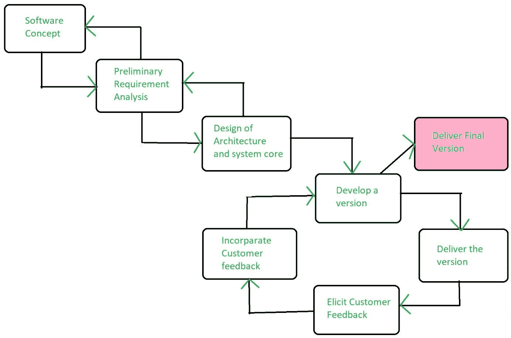

# 软件工程|进化模型

> 原文:[https://www . geesforgeks . org/software-engineering-evolutionary-model/](https://www.geeksforgeeks.org/software-engineering-evolutionary-model/)

**进化模型**是软件开发生命周期的[迭代](https://www.geeksforgeeks.org/software-engineering-iterative-waterfall-model/)和[增量模型](https://www.geeksforgeeks.org/software-engineering-incremental-process-model/)的组合。在一个大爆炸的版本中交付您的系统，随着时间的推移以递增的过程交付它是在这个模型中完成的操作。需要完成一些初始需求和架构设想。

由于用户反馈和其他因素，在开发过程中重新定义特性集的软件产品更好。进化开发模型将开发周期分成更小的增量瀑布模型，在这些模型中，用户能够在每个周期结束时访问产品。

用户在下一个周期的计划阶段对产品提供反馈，开发团队通常通过改变产品、计划或流程来做出响应。因此，软件产品随着时间的推移而演变。
所有的模型都有一个缺点，从项目开始到解决方案交付时间的持续时间非常长。进化模型用不同的方法解决了这个问题。

进化模型建议将工作分解成更小的块，对它们进行优先排序，然后将这些块一个接一个地交付给客户。组块的数量是巨大的，是交付给客户的数量。主要优势是客户的信心增加，因为他从项目开始就不断获得可量化的商品或服务来验证和确认他的需求。该模型允许改变需求，以及将所有工作分解成可维护的工作块。

**进化模型的应用:**

1.  它用于大型项目，在这些项目中，您可以轻松找到用于增量实现的模块。当客户希望开始使用核心功能而不是等待完整的软件时，通常使用进化模型。
2.  进化模型也用于面向对象的软件开发，因为系统可以很容易地按照对象划分成单元。

**优势:**

*   在进化模型中，用户有机会试验部分开发的系统。
*   它减少了错误，因为核心模块得到彻底测试。

**缺点:**

*   有时很难将问题分成客户可以接受的几个版本，这些版本可以逐步实施和交付。