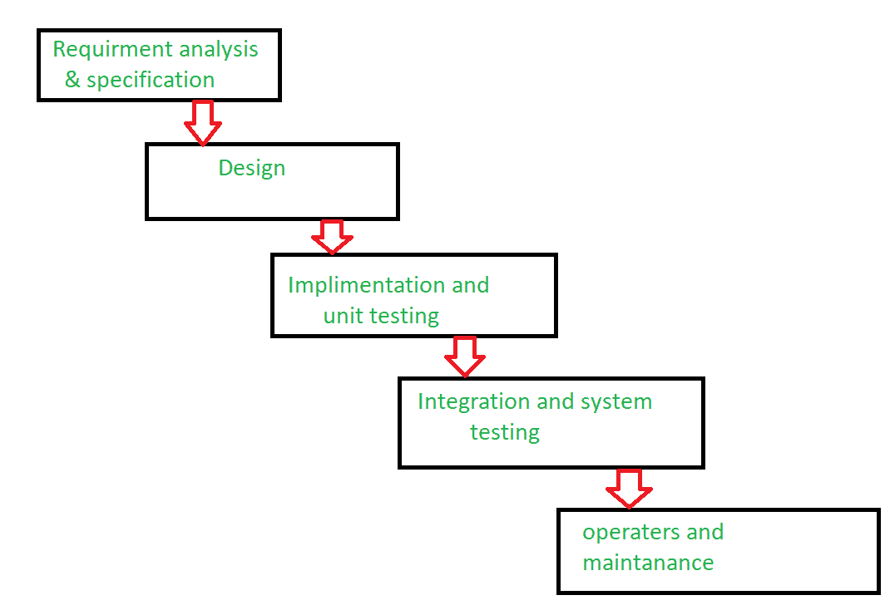

# 软件工程|瀑布模型失败

> 原文:[https://www . geesforgeks . org/software-engineering-failure-of-falls-model/](https://www.geeksforgeeks.org/software-engineering-failure-of-waterfall-model/)

[瀑布模型](https://www.geeksforgeeks.org/software-engineering-classical-waterfall-model/)又称传统瀑布软件生命周期模型。理解和使用起来非常简单。在瀑布模型中，每个阶段必须在下一个阶段开始之前完成，并且阶段之间没有重叠。

经典的瀑布模型将生命周期划分为一组阶段。瀑布模型认为一个阶段可以在前一个阶段完成后开始，这是一个阶段的输出将是下一个阶段的输入。因此，开发过程可以被认为是瀑布中的连续流程。这里的相位彼此不重叠。

该模型将软件开发过程的生命周期划分为几个阶段，如图所示。

**瀑布模型失败的原因:**
传统的瀑布模型存在着各种各样的缺点，基本上我们无法在真实的项目中使用它，但是我们使用了其他基于经典瀑布模型的软件开发生命周期模型。

由于瀑布模型失败，下面给出了一些原因。

1.  **单行道:**
    这个模式就跟单行道一样。一旦阶段 X 完成，下一个阶段 Y 已经开始，那么就没有办法回到上一个阶段。这是瀑布模型失败的原因之一。
2.  **重叠:**
    瀑布模型缺少了相位间的重叠。瀑布模型建议新阶段只能在前一阶段完成后开始。但在实际项目中，这是无法维持的。为了提高效率和降低成本，阶段可能会重叠。
3.  **交互:**
    瀑布模型缺少了相位之间的交互。用户很少与 project 他们互动。这种反馈不是在开发过程中得到的。在一个开发过程开始后，变化是不容易适应的。
4.  **支持系统交付:**
    瀑布模型不支持系统分片交付。在开发过程开始后，变化不容易适应。
5.  **反馈路径:**
    瀑布模型没有反馈路径。在传统的瀑布模型中，软件从一个阶段到另一个阶段的演化就像瀑布一样。瀑布模型假设开发人员在任何阶段都不会犯错误。因此，它不包含任何纠错机制。
6.  **不灵活:**
    难以适应变更请求。瀑布模型假设所有的客户需求都可以在项目开始时被完全正确地定义，但是实际上客户的需求会随着时间的推移而不断变化。需求规范阶段完成后，很难适应任何变更请求。