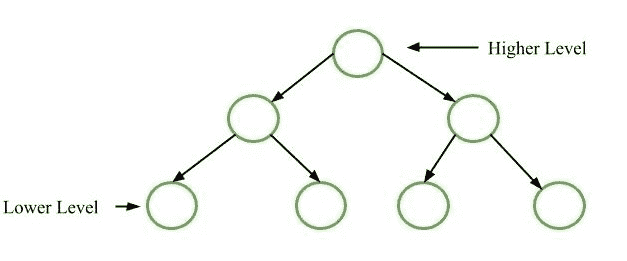
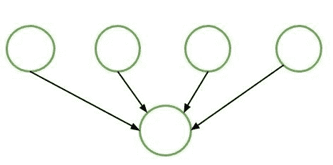

# 软件工程|面向功能的设计

> 原文:[https://www . geesforgeks . org/software-engineering-function-oriented-design/](https://www.geeksforgeeks.org/software-engineering-function-oriented-design/)

软件系统的设计过程通常有两个层次。在第一个层次上，重点是根据 SRS(软件需求规范)决定系统需要哪些模块，以及这些模块应该如何互连。

**面向功能的设计**是一种软件设计方法，其中设计被分解成一组相互作用的单元，每个单元都有明确定义的功能。

**通用程序:**
首先对软件/程序的功能进行高级描述。通过更详细地指定每个部分的功能，逐个细化描述的每个部分。这些点导致自上而下的结构。

**自顶向下设计方法中的问题:**
大多数情况下，每个模块最多被另一个模块使用，该模块被称为其父模块。

**问题解决方案:**
可复用模块设计。这意味着模块使用几个模块来完成它们所需的功能。

**面向功能的设计策略:**
面向功能的设计策略如下:

1.  **[数据流图(DFD)](https://www.geeksforgeeks.org/levels-in-data-flow-diagrams-dfd/) :**
    数据流图(DFD)描绘出任何流程或系统的信息流。它使用已定义的符号，如矩形、圆形和箭头，加上短文本标签，来显示数据输入、输出、存储点和每个目的地之间的路线。
2.  **数据字典:**
    数据字典只是存储 DFDs 中定义的所有数据项信息的存储库。在需求阶段，数据字典包含数据项。数据字典包括项目名称、别名(项目的其他名称)、描述/用途、相关数据项、值范围、数据结构定义/形式。
3.  **Structure Charts:**
    It is the hierarchical representation of system which partitions the system into black boxes (functionality is known to users but inner details are unknown). Components are read from top to bottom and left to right. When a module calls another, it views the called module as black box, passing required parameters and receiving results.

    **伪代码:**
    伪代码是系统描述用简短的英语像描述功能的短语。它使用关键字和缩进。伪代码被用来代替流程图。它减少了所需的文档量。