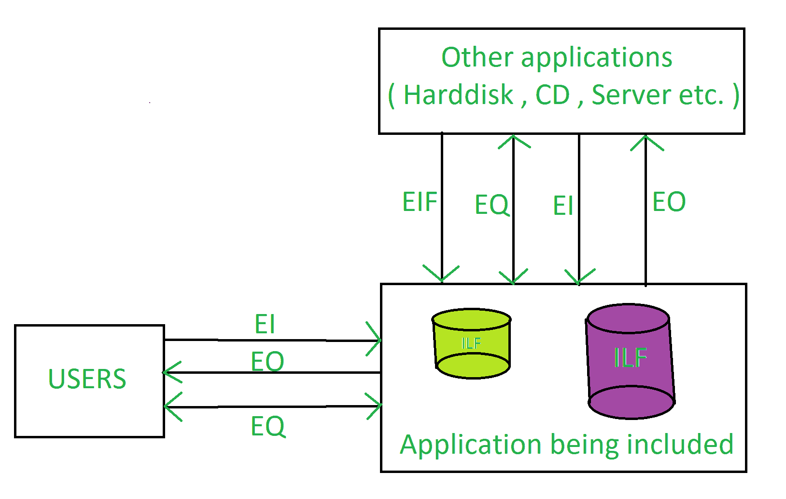

# 软件工程|功能点(FP)分析

> 原文:[https://www . geesforgeks . org/software-engineering-functional-point-FP-analysis/](https://www.geeksforgeeks.org/software-engineering-functional-point-fp-analysis/)

功能点分析最初是由艾伦·阿尔伯赫特于 1979 年在国际商用机器公司开发的，并由国际功能点用户小组进一步修改。

最初的**定义**是由艾伦·j·阿尔布雷特**给出的:**

> FPA 给出了在功能点中定义的无量纲数，我们发现这是交付给客户的功能值的有效相对度量。

FPA 提供了一种标准化的方法来在功能上确定软件工作产品的大小。这个工作产品是后续版本的软件新开发和改进项目的输出。它是在项目实施时重新定位到生产应用程序的软件。它从用户的角度来衡量功能，即基于用户的请求和回报。

功能点分析是功能尺寸测量的一种方法或一套规则。它基于用户对功能需求的外部视图来评估交付给用户的功能。它度量应用程序的逻辑视图，而不是物理实现的视图或内部技术视图。

功能点分析技术用于分析软件提供的功能，未调整功能点(UFP)是测量单位。

### **平安险的目标:**

*   FPA 的目标是衡量用户请求和接收的功能。
*   财务绩效评估的目标是独立于用于实施的技术来衡量软件开发和维护。
*   它应该足够简单，以最小化测量过程的开销。
*   它应该是各种项目和组织之间一致的度量标准。

### **平安险类型:**

*   **交易功能类型–**
    *   **外部输入(EI):** EI 处理来自应用程序边界之外的数据或控制信息。教育信息是一个基本的过程。

    *   **外部输出(EO):** EO 是生成发送到应用程序边界之外的数据或控制信息的基本过程。

    *   **外部查询(EQ):** EQ 是由导致数据检索的输入输出组合组成的基本过程。

*   **数据功能类型–**
    *   **内部逻辑文件(ILF):** 在应用程序边界内维护的一组用户可识别的逻辑相关数据或控制信息。

    *   **外部接口文件(EIF):** 一组用户可识别的逻辑相关数据，指向软件，但保持在另一个软件的边界内。

### 

**平安险的福利:**

*   FPA 是一个工具，通过计算包中包含的所有功能来确定购买的应用程序包的大小。
*   它是一种工具，通过计算与用户需求特别匹配的功能，帮助用户发现应用程序包对其组织的好处。
*   它是一个测量软件产品单位的工具，以支持质量和生产力分析。
*   它是估算软件开发和维护所需成本和资源的工具。
*   它是软件比较的标准化因素。

### **平安险的缺点:**

*   需要主观评价，涉及很多判断。
*   很多成本和努力模型都是基于 LOC 的，所以需要改变功能点。
*   相比 LOC，在功能点上有的少了的研究数据。
*   创建设计规范后运行。
*   主观判断，评估准确率低。
*   由于学习曲线较长，不易获得熟练度。
*   这是一个非常耗时的方法。