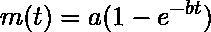
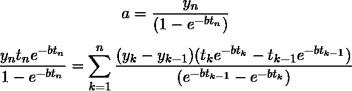
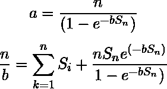
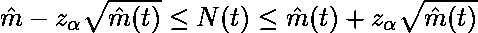
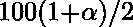

# 软件工程| Goel-Okumoto 模型

> 原文:[https://www . geesforgeks . org/software-engineering-goel-oku moto-model/](https://www.geeksforgeeks.org/software-engineering-goel-okumoto-model/)

Goel-Okumoto 模型(也称为指数 NHPP 模型)基于以下假设:

1.  程序中的所有故障都与故障检测观点相互独立。
2.  任何时候检测到的故障数量都与程序中当前的故障数量成正比。这意味着故障实际发生(即检测到)的概率是恒定的。
3.  在未来的测试场合之前，隔离的故障被移除。
4.  每次发生软件故障时，导致故障的软件错误会立即被删除，并且不会引入新的错误。

这显示在下面的微分方程中:

![$\frac{\partial m(t)}{\partial t} = b[a-m(t)]$  \null\hfill    Eqn(1)](img/a31dffa6557b338c53782f01b8ee158a.png "Rendered by QuickLaTeX.com")

其中 a 是测试前软件中存在的预期故障总数，b 是故障检测率或故障的故障强度。

微分方程 1 的平均值函数解由下式给出

这个模型被称为 **Goel-Okumoto 模型**

对于第一类数据，使用最大似然估计方法的 Goel-Okumoto 模型的参数 a 和 b 的估计可以通过同时求解以下方程获得:

类似地，对于第二类数据，使用最大似然估计
方法对参数 a 和 b 的估计可以通过求解以下方程获得:

设和分别为参数 a 和 b 的 MLE。然后，我们可以获得平均值函数和可靠性函数的最大似然估计，如下所示:

![$\hat{m} (t)=\hat{a} [1-e^{-\hat{b}t}]$ $ \hat{R} (x|t)=e^{-\hat{a}[e^{-\hat{b}t}-e^{-\hat{b}(t+x)}]}$ ](img/6418b17dde98cc2a0b9ec2d70f399f86.png "Rendered by QuickLaTeX.com")

在时间 t，N(t)确定故障数量的可变性是有意义的。人们可以根据泊松分布近似地获得 N(t)的置信区间

其中为标准正态分布的百分位，即 N(0，1)。