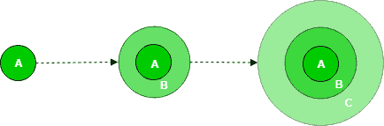
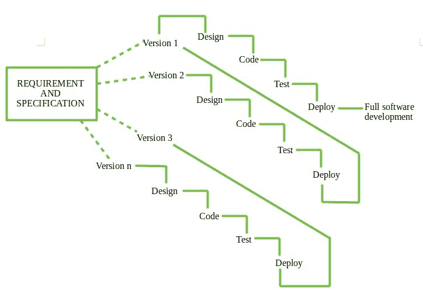
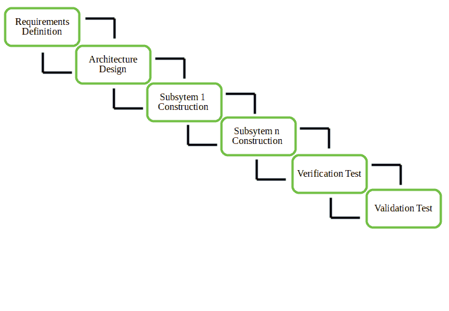
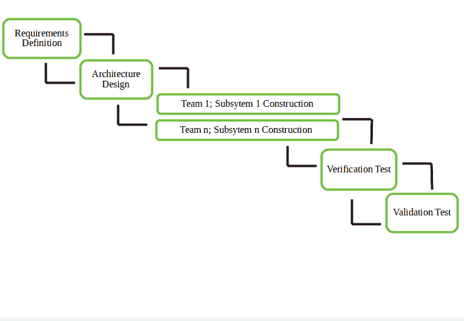

# 软件工程|增量过程模型

> 原文:[https://www . geesforgeks . org/软件-工程-增量-流程-模型/](https://www.geeksforgeeks.org/software-engineering-incremental-process-model/)

增量过程模型也被称为连续版本模型。

首先，构建一个只实现一些基本功能的简单工作系统，然后将其交付给客户。然后，许多连续的迭代/版本被实现并交付给客户，直到期望的系统被发布。

a、B、C 是逐步开发和交付的软件产品模块。

**生命周期活动–**
软件的需求首先被分解成几个模块，这些模块可以增量构建和交付。在任何时候，这个计划都是为下一个增量而制定的，而不是任何一种长期计划。因此，更容易根据客户的需要修改版本。开发团队首先负责开发系统的核心特性(这些不需要来自其他特性的服务)。

一旦核心特性被完全开发出来，这些特性就会被细化，通过在后续版本中添加新的功能来提高能力水平。每个增量版本通常使用迭代瀑布开发模型来开发。

随着软件的每一个连续版本的构建和交付，现在将获取客户的反馈，然后将这些反馈纳入下一个版本。该软件的每个版本都比前几个版本有更多的附加功能。

在需求收集和规范之后，需求被分成几个不同的版本，从版本 1 开始，在每个连续的增量中，构建下一个版本，然后在客户站点部署。在最后一个版本(版本 n)之后，它现在部署在客户端。

**增量模型的类型–**

1.  **Staged Delivery Model –** Construction of only one part of the project at a time.

    

2.  **Parallel Development Model –** Different subsystems are developed at the same time. It can decrease the calendar time needed for the development, i.e. TTM (Time to Market), if enough Resources are available.

    

**何时使用–**

1.  资金计划、风险、计划复杂性或提前实现收益的需要。
2.  当预先知道需求时。
3.  当项目有冗长的开发时间表时。
4.  Projects with new Technology.

    **优势–**

    *   减少错误(客户从阶段开始就使用核心模块，然后对这些模块进行全面测试)
    *   使用分治法进行任务分解。
    *   降低初始交付成本。
    *   增量资源部署。

    **缺点–**

    *   需要良好的规划和设计。
    *   总成本不低。
    *   需要定义良好的模块接口。