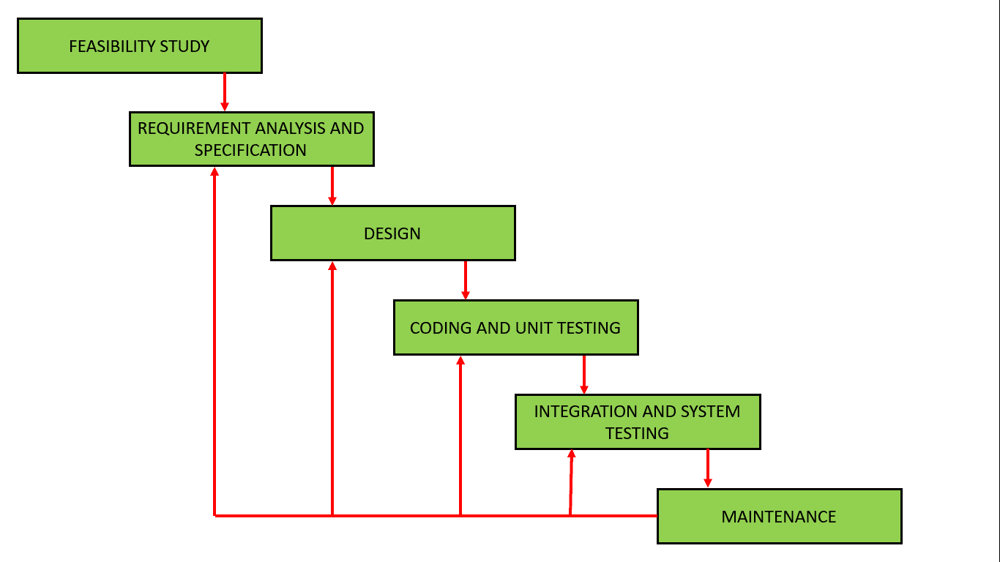

# 软件工程|迭代瀑布模型

> 原文:[https://www . geesforgeks . org/软件-工程-迭代-瀑布-模型/](https://www.geeksforgeeks.org/software-engineering-iterative-waterfall-model/)

在实际的软件开发项目中，[经典瀑布模型](https://www.geeksforgeeks.org/software-engineering-classical-waterfall-model/)很难使用。因此，迭代瀑布模型可以被认为是对经典瀑布模型进行了必要的修改，使其在实际的软件开发项目中可用。它几乎和经典的瀑布模型一样，只是做了一些改变来提高软件开发的效率。

迭代瀑布模型提供了从每个阶段到其前面阶段的反馈路径，这是与经典瀑布模型的主要区别。

迭代瀑布模型引入的反馈路径如下图所示。

当在稍后阶段检测到错误时，这些反馈路径允许纠正程序员在某个阶段犯下的错误。反馈路径允许在提交错误的阶段进行返工，并且这些变化反映在后面的阶段中。但是，这个阶段没有反馈路径——可行性研究，因为一旦项目被采纳，就不会轻易放弃项目。

在提交错误的同一个阶段检测错误是很好的。它减少了纠正错误所需的工作量和时间。

**错误的阶段遏制:**
检测错误尽可能接近其承诺点的原则被称为错误的阶段遏制。

**迭代瀑布模型的优势:**

*   **反馈路径–**
    在经典瀑布模型中，没有反馈路径，因此没有纠错机制。但是在迭代瀑布模型中，从一个阶段到它的前一个阶段的反馈路径允许纠正所提交的错误，并且这些变化反映在后面的阶段中。
*   **简单–**
    迭代瀑布模型的理解和使用非常简单。这就是为什么它是最广泛使用的软件开发模型之一。
*   **成本效益–**
    改变模型中的计划或需求，成本效益非常高。此外，它最适合敏捷组织。
*   **组织良好–**
    在这个模型中，花在记录上的时间更少，团队可以花更多的时间在开发和设计上。

**迭代瀑布模型的缺点:**

*   **难以合并变更请求–**
    迭代瀑布模型的主要缺点是，在开始开发阶段之前，必须清楚地陈述所有的需求。客户可能会在一段时间后更改需求，但是迭代瀑布模型没有留下任何余地来合并开发阶段开始后提出的更改请求。

*   **不支持增量交付–**
    在迭代瀑布模型中，完整的软件在交付给客户之前已经完成开发和测试。没有任何中间交付的余地。因此，客户必须等待很长时间才能获得软件。

*   **不支持阶段重叠–**
    迭代瀑布模型假设一个阶段可以在前一个阶段完成后开始，但是在实际项目中，阶段可能会重叠，以减少完成项目所需的工作量和时间。

*   **不支持风险处理–**
    项目可能遭受各种类型的风险。但是，迭代瀑布模型没有风险处理机制。

*   **有限的客户互动–**
    客户互动发生在需求收集时的项目开始阶段和软件交付时的项目完成阶段。由于最终开发的软件可能与客户的实际需求不同，因此与客户的这些较少的交互可能会导致许多问题。