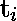
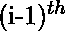
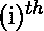
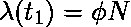
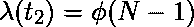
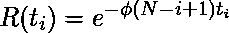

# 软件工程| Jelinski Moranda 软件可靠性模型

> 原文:[https://www . geesforgeks . org/software-engineering-jelinski-morada-software-reliability-model/](https://www.geeksforgeeks.org/software-engineering-jelinski-moranda-software-reliability-model/)

Jelinski-morada 模型是最早的软件可靠性模型之一。许多现有的软件可靠性模型都是这种基本模型的变体或扩展。

**假设:**
该模型中的假设包括以下内容:

1.  程序包含 N 个初始故障，这是一个未知但固定的常数。
2.  程序中的每一个错误都是独立的，在测试过程中同样可能导致失败。
3.  故障发生之间的时间间隔相互独立。
4.  每当发生故障时，相应的故障肯定会被排除。
5.  导致故障的故障被认为是瞬间消除的，并且在检测到的故障消除期间没有新的故障被插入。
6.  故障间隔期间的软件故障率是恒定的，并且与程序中剩余的故障数量成比例。

第 I 个故障间隔的程序故障率由下式给出:

![$  \lambda (t_i)= \phi [N-(i-1)], \; \; i=1, 2, ..., N$](img/a6c6759ecbb5543ea1e9f2810fe28abb.png "Rendered by QuickLaTeX.com")

其中
 =比例常数，任何一个故障对整个程序的贡献
N =程序中初始故障的数量
 =从到故障之间的时间。

例如，初始故障强度为

第一次故障后，故障强度降低至

等等。
的部分分布函数(pdf)为

![$f(t_i)=\phi [N-(i-1)]e^{-\phi (N-(i-1))t_i}$](img/7247d04b00b91ba28e6b563b53e3549a.png "Rendered by QuickLaTeX.com")

的累积分布函数(cdf)为

![$F(t_i)=1- e^{-\phi [N-(i-1)]t_i}$](img/8846d972a88cac494c6476c16c589c09.png "Rendered by QuickLaTeX.com")

因此，软件可靠性功能是，

