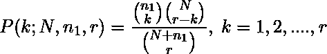
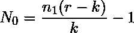
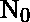
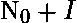
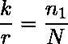
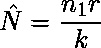
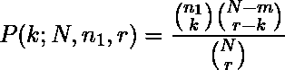

# 软件工程|米尔斯误差播种模型

> 原文:[https://www . geesforgeks . org/software-engineering-mills-error-seeding-model/](https://www.geeksforgeeks.org/software-engineering-mills-error-seeding-model/)

**米尔斯误差播种模型**提出了一种误差播种方法，通过在程序中引入播种误差来估计程序中的误差数量。根据由固有误差和诱导误差组成的调试数据，可以估计未知数量的固有误差。如果固有误差和诱导误差都同样可能被检测到，那么在 r 个去除的误差中 k 个诱导误差的概率遵循超几何分布，该分布由下式给出

其中
N =固有误差总数
n1 =诱导误差总数
r =调试期间去除的误差总数
k = r 去除误差中诱导误差总数
r–k = r 去除误差中固有误差总数

因为 n1、r 和 k 是已知的，所以 N 的最大似然估计可以表示为

![$\hat{N} = [N_0]+1$](img/22d93007c4409e990d995e92f4fda6e1.png "Rendered by QuickLaTeX.com")

在哪里

如果是整数，那么和都是 n 的最大似然估计

**缺点:**

1.  对软件进行测试是昂贵的，同时也增加了测试的工作量。
2.  这种方法也受到批评，因为它不能确定诱发错误的类型、位置和难度水平，因此它们被检测到的可能性与固有错误相同。

另一种估计程序中剩余错误的现实方法是基于两个独立的程序员组，使用独立的测试用例集测试程序的错误。假设在总共 N 个初始错误中，第一个程序员检测到 n1 个错误(并且根本没有删除它们)，第二个程序员独立地从同一个程序中检测到 r 个错误。

假设两个程序员都发现了 k 个常见错误。如果所有错误被检测到的机会相等，则随机选择的错误子集(例如，r)的第一编程器检测到的分数(k)应该等于初始错误总数 n 的第一编程器检测到的分数(n1)。换句话说，

因此初始误差总数的估计值为

在第二编程器检测到的 r 个误差中具有 k 个公共误差的恰好 N 个初始误差的概率可以使用如下的超几何分布来获得:

N 的最大似然估计是

这与上面的相同。