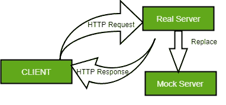

# 软件工程| MOCK(简介)

> 原文:[https://www . geesforgeks . org/software-engineering-mock-introduction/](https://www.geeksforgeeks.org/software-engineering-mock-introduction/)

模拟是一个克隆真实对象行为的对象。它基本上用于单元测试，通过测试隔离的单元，即使后端不可用。

**我们为什么要用 MOCK 对象？**
单元测试的目的是批准软件设计的每个单元，并验证生成的代码工作正常，依赖于外部依赖。大多数情况下，测试中的代码有一些外部依赖关系，比如 API，最好创建一个模拟对象，而不是在依赖关系的真实对象上生成测试用例。

web 应用程序由两个组件组成:**前端**和**后端**服务器，它们相互依赖并同时运行。前端的开发人员依赖于服务器、应用编程接口和其他外部服务的后端开发人员。在测试或开发阶段，一个主要的挑战是处理各种外部依赖。
Real Environment 通过服务器交换他们的数据，其中用户终端服务由不同的服务器处理，管理服务由另一个服务器处理。开发软件时面临困难的开发人员。另一方面，当软件依赖于外部依赖时，测试人员不能进行有效的单元测试。为了提供有效的测试，需要模拟服务器。模拟服务器消除了对真实服务器的依赖，允许测试人员独立进行测试。图给出了模拟服务器的虚拟表示。

现在，为了有效地利用我们的时间和改进测试机制，需要一个模仿真实服务器的 Mock 服务器，模仿它的依赖关系。单元测试 Java 应用程序可用的一些模拟框架有 Jmock、Mockito、EasyMock。对于单元测试，通过模拟所需的接口，可以使用模拟对象来代替真实对象。在基于界面的设计系统中，模型最容易使用。

使用模拟对象进行单元测试需要遵循一些模式:

1.  构建模拟对象的实例或对象。
2.  在定义的环境下定义模拟对象的状态。
3.  在模拟对象中设置期望、状态代码、响应、错误显示。
4.  将 Mock 对象设置为域代码下的参数。
5.  验证单元测试下的模拟对象。