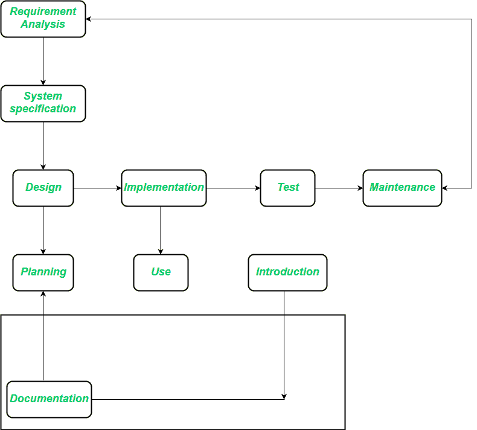

# 软件工程|面向对象生命周期模型

> 原文:[https://www . geesforgeks . org/software-engineering-object-oriented-life cycle-model/](https://www.geeksforgeeks.org/software-engineering-object-oriented-life-cycle-model/)

面向对象的系统构建方法以对象为基础。为此，首先要观察和分析要开发的系统，并按照任何其他系统开发方法定义需求。一旦这样做了，所需系统中的对象就被识别出来了。例如，在银行系统的情况下，客户是对象，支票簿是对象，甚至账户也是对象。

面向对象模型采用面向对象的策略。主要目标是:

```
1. Object-oriented analysis,
2. Object-oriented design,
3. Object-oriented programming 
```

面向对象的分析开发了应用领域的面向对象模型。面向对象设计开发了软件系统的面向对象模型。面向对象编程使用面向对象编程语言实现软件设计，该语言支持对象、类和继承的直接实现。

有多种面向对象的方法，例如:

*   **对象识别:**
    系统对象及其特征和事件。
*   **对象组织:**
    展示对象如何通过“部分”关系联系起来。
*   **对象接口:**
    显示对象如何与其他对象交互。

这些活动往往是重叠的，总体上是平行的。



需求分析阶段努力实现对客户应用领域的理解。软件解决方案必须解决的任务出现在需求分析的过程中。需求分析阶段完全独立于以后可能应用的实现技术。

在系统规范部分，需求定义描述了软件产品必须做什么，但没有描述如何实现这个目标。

与传统阶段模型的一个分歧点出现了，因为面向对象编程的实现是以已经存在的组件的组装为标志的。类库是一种工具，它超越了单个项目的范围，因为一个项目提供的类可以提高后续项目的生产率。

**面向对象生命周期模型的优势:**

*   设计不再独立于后期实现来执行，因为在设计阶段，我们必须考虑哪些组件可用于解决问题。
*   设计和实现变得更加紧密相关。
*   实施阶段的持续时间缩短。
*   一个新的职位出现了，班级图书管理员，他负责确保班级图书馆的有效可用性。