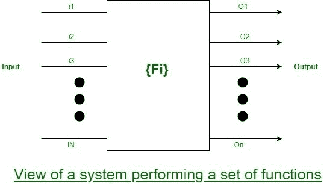

# 软件工程| SRS 文档的一部分

> 原文:[https://www . geesforgeks . org/software-engineering-parts-a-SRS-document/](https://www.geeksforgeeks.org/software-engineering-parts-of-a-srs-document/)

[软件需求规范(SRS)](https://www.geeksforgeeks.org/software-engineering-quality-characteristics-of-a-good-srs/) 文档的重要部分是:

1.  系统的功能要求
2.  系统的非功能性要求，以及
3.  实施目标

这些解释如下。

**1。功能需求:**
有目的的需求部分讨论了系统所需的功能，考虑系统来执行一组高级功能 Fi。系统的功能视图如下图所示系统的每个功能 F *i* 可以看作是一组输入数据 Ii 到相应的一组输出知识 Oi 的转换。
用户将通过高级操作完成一些有目的的工作。

**2。非功能性需求:**
非功能性必需品适应系统的特性，这些特性可能不能用功能来表达——比如系统的可维护性、系统的可移动性、系统的可用性等。非功能性要求可能包括:

1.  可靠性问题
2.  结果的准确性
3.  人机界面问题
4.  对系统实施的限制等。

**3。实施目标:**
实施目标部分记录了一些与发展相关的一般性建议。这些建议指导风格目标之间的权衡。实现部分的目标可能会记录一些问题，如未来需要的系统功能的修订、未来需要支持的新设备、可重用性问题等。这些是开发人员在整个开发过程中可能会保留的东西，以便开发的系统可以满足一些看起来不需要的方面。