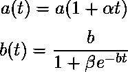
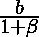

# 软件工程| Pham-Nordmann-Zhang 模型(模型)

> 原文:[https://www . geesforgeks . org/software-engineering-Pham-nord Mann-Zhang-model-pnz-model/](https://www.geeksforgeeks.org/software-engineering-pham-nordmann-zhang-model-pnz-model/)

**Pham Nordmann Zhang (PNZ)模型**用于评估基于组件的系统或软件的可靠性预测和容错结构技术。PNZ 被认为是最好的模型之一，它基于非齐次泊松过程(NHPP)。

我们的目标是基于可靠性预测和对各种模型敏感性的仔细分析，使用 PNZ 模型生产可靠性预测工具。因此，PNZ 使我们能够分析，通过使用容错结构技术，软件系统的可靠性可以提高多少，这将在本节后面讨论。

**PNZ 模型使用的假设–**

1.  利用非齐次泊松过程对故障排除现象进行建模。
2.  软件在执行过程中会出现故障，这是由于软件中存在故障造成的。
3.  引入率是一个线性函数，依赖于时间的总体故障含量函数。
4.  故障去除率形成 S 型曲线，可以用来理解软件测试人员的学习过程。
5.  由于故障的产生，在调试过程中会在软件中引入故障。
6.  故障检测率函数是一个非递减的时间相关的 S 型拐点模型。

**定理:**
假设时变故障内容函数和错误检测率分别为:

其中 a = a(0)是测试前软件中存在的初始故障总数的参数，是初始每故障可见性或故障强度。等式![ {\frac{\partial m(t)}{\partial t} }=b(t)[a(t)-m(t)] ](img/4a9893b8a1e946ca2222d81641f4dafe.png "Rendered by QuickLaTeX.com")的平均值函数由下式给出

![$m(t)=\frac{a}{1+\beta e^{-bt}}\left ([1-e^{-bt}]\left [1-\frac{\alpha }{\beta } \right ]+\alpha t \right )$](img/80e65e81fcd7b5a2e6181e185943e8de.png "Rendered by QuickLaTeX.com")

这种模式被称为 PNZ 模式。换句话说，PNZ 模型通过假设故障可以在调试阶段以每检测到一个故障的恒定速率引入，从而结合了不完美调试现象。

因此，故障率函数 a(t)是测试时间的线性函数。该模型还假设故障检测率函数 b(t)是一条不变的 S 型曲线，它可以捕捉软件测试人员的“学习”过程。