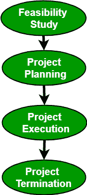

# 软件工程|项目管理流程

> 原文:[https://www . geesforgeks . org/software-engineering-project-management-process/](https://www.geeksforgeeks.org/software-engineering-project-management-process/)

项目管理是将知识、技能、工具和技术应用于项目活动，以满足项目要求。

**项目管理流程由以下 4 个阶段组成:**

*   可行性研究
*   计划图编制
*   项目执行
*   项目终止

**可行性研究:**
可行性研究探索系统需求，确定项目可行性。可行性研究有几个领域，包括经济可行性、操作可行性、技术可行性。目标是确定系统能否实现。可行性研究过程将用户指定的所需细节和其他特定领域的细节作为输入。这个过程的输出只是告诉项目是否应该进行，如果应该，会有什么限制。此外，在决定启动项目之前，还会评估所有风险及其对项目的潜在影响。

**项目规划:**
详细的计划说明实现所列目标的逐步战略是任何项目不可分割的一部分。
规划包括以下活动:

*   设定目标或目的
*   制定策略
*   制定项目政策
*   确定行动方案
*   做出规划决策
*   为项目设定程序和规则
*   制定软件项目计划
*   编制预算
*   进行风险管理
*   记录软件项目计划

这一步还包括构建工作分解结构(WBS)。它还包括规模、工作量、进度和使用各种技术的成本估算。

**项目执行:**
通过选择合适的软件开发生命周期模型(SDLC)来执行项目。它包括许多步骤，包括需求分析、设计、编码、测试和实现、测试、交付和维护。在这样做的时候，有许多因素需要考虑，包括系统的规模、项目的性质、时间和预算限制、领域需求等。不适当的 SDLC 可能导致项目失败。

**项目终止:**
一个项目的终止可能有几个原因。虽然期望项目在成功完成后终止是常规的，但有时，项目也可能在没有完成的情况下终止。根据给定的时间和成本限制，当需求没有得到满足时，项目必须关闭。
失败的部分原因包括:

*   快速变化的技术
*   项目时间不多了
*   组织政治
*   客户需求变化太大
*   超出预算或资金的项目

一旦项目终止，就要进行绩效后分析。此外，还会发布一份最终报告，描述经验、教训和处理未来项目的建议。