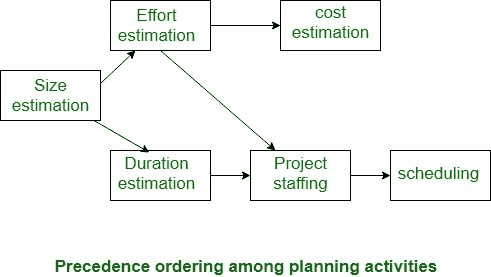

# 软件工程|项目规划

> 原文:[https://www . geesforgeks . org/software-engineering-project-planning/](https://www.geeksforgeeks.org/software-engineering-project-planning/)

一旦发现一个项目是可能的，计算机代码项目经理就承担项目设计。项目设计甚至在任何开发活动开始之前就已经开始并完成了。项目设计包括后续的基本活动:

评估项目的后续属性:

*   **项目规模:**
    就开发产品所需的麻烦和时间而言，质量会有什么下降？
*   **成本:**
    开发项目达到价值的比例是多少？
*   **持续时间:**
    达到想要完全发育的程度需要多长时间？
*   **努力:**
    需要多大比例的努力？

以下设计活动的有效性取决于这些估计的准确性。

*   规划力量和替代资源
*   工人组织和人员配置计划
*   风险识别、分析和消除设计
*   其他安排，如质量保证计划、配置、管理安排等。

**项目计划活动的优先顺序:**
已经提到了项目经理所做的不同项目关联评估。下图显示了重要项目开展活动的顺序。可以简单地发现，规模估算是第一个活动。它是最重要的基本参数，支持所有的替代方案，如活动平方度量，替代估计，如努力、成本、资源和项目长度的估计，也是项目的重要组成部分。

**滑动窗口规划:**
项目设计需要最大程度的谨慎和关注，因为对不切实际的时间和资源估计的承诺最终会导致进度延误。进度延误会引起客户不满，并对团队士气产生不利影响。甚至会导致项目失败。

然而，项目设计可能是一项非常困难的活动。尤其是对于巨人来说，创建正确的计划非常麻烦。这个问题的一个区域是由于实际的事实，正确的参数，项目的范围，项目工人等。可能会在项目的整个过程中修改。为了克服这个缺点，一般项目经理会一点一点地进行项目设计。在不同的阶段设计一个项目可以防止管理者过早地做出巨大的承诺。这种交错设计的方法被认为是窗户设计。在窗口技术中，从相关的初始设置开始，项目在连续的开发阶段被额外精确地计划。

在项目开始时，项目经理对项目要点的信息不完整。他们的信息库一步一步地改进，因为项目通过完全不同的阶段进行。当每一部分完成后，项目经理将建立每一个不可告人的部分，并增加信心。