# 软件工程|准更新流程

> 原文:[https://www . geesforgeks . org/软件-工程-准续约-流程/](https://www.geeksforgeeks.org/software-engineering-quasi-renewal-processes/)

设{N(t)，t > 0}为计数过程，设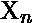为该过程的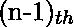和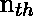事件之间的时间，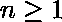。

**定义:**
非负随机变量序列{X1，X2，…。}是独立的

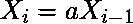

对于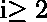中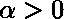为常数，则计数过程{N(t)，t  0}称为带参数和第一个到达间隔时间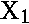的准更新过程。

当 = 1 时，这个过程成为普通的更新过程。这种准更新过程可用于 > 1 的软件测试阶段和硬件老化阶段的可靠性增长过程建模，以及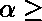 1 时的硬件维护过程建模。

**与准更新过程相关的重要公式:**
分别假设随机变量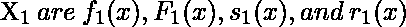的概率密度函数、累积分布函数、生存函数和失效率。然后，

1.  The pdf(probability density function) of Xn for n = 1, 2, 3, … is

    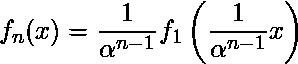

2.  The cdf(cumulative density function) of Xn for n = 1, 2, 3, … is

    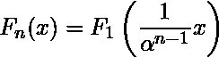

3.  The survival function of Xn for n = 1, 2, 3, … is

    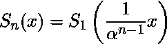

4.  The failure rate of Xn for n = 1, 2, 3, … is

    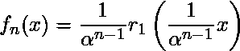

类似地，Xn 的均值和方差如下所示

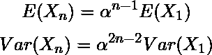

由于的非负性和不是同 0 的事实，我们得到

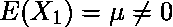

**命题-1:**
如果遵循伽玛、威布尔或对数正态分布，那么对于准更新过程来说的形状参数对于 n = 1、2、3、…是相同的。这意味着“更新”后，到达间隔时间的形状参数不会改变。在软件可靠性中，软件调试过程不改变无错分布类型的假设似乎是合理的。

因此，在由准更新过程建模的调试阶段期间，软件的无错误时间将具有相同的形状参数。从这个意义上说，准更新过程适合于对软件可靠性增长建模。值得注意的是，

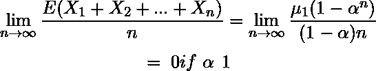

因此，如果到达间隔时间代表软件系统的无错误时间，那么当其调试过程长时间发生时，平均无错误时间接近无穷大。

**命题-2:**
拟更新过程的首次到达间隔分布唯一地决定了其更新函数。如果到达间隔时间代表无错误时间(首次故障时间)，则可以使用准更新过程来模拟软件和硬件的可靠性增长。

假设软件的所有故障都有相同的被检测到的机会。如果准更新过程的到达间隔时间代表软件系统的无错误时间，那么时间间隔[0，t]内软件故障的预期数量可以由更新函数 m(t)定义，参数为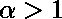。由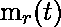表示，在时间 t 剩余的软件故障的数量，如下:

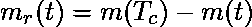

其中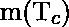是最终将通过软件生命周期 Tc 检测到的故障数量。