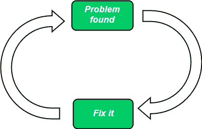

# 软件工程|快速修复模型

> 原文:[https://www . geesforgeks . org/software-engineering-quick-fix-model/](https://www.geeksforgeeks.org/software-engineering-quick-fix-model/)

**软件维护**是交付后对软件系统进行修改，以纠正故障、添加新功能和删除过时功能的过程。维护过程因所维护软件的类型而有很大不同。
软件生命周期中最昂贵的部分是软件维护过程。

软件系统的维护有一些模型，Qquick-fix 模型就是其中之一。

**快速修复模式:**

*   这基本上是一种维护软件的临时方法。
*   这是一种灭火方法，等待问题出现，然后尽快解决。
*   这个模型的主要目标是识别问题，然后尽快修复它。
*   在这个模型中，在不接受未来问题的情况下，尽可能早地在代码级别进行更改。
*   这种模型是一种修改软件代码的方法，而很少考虑它对软件系统整体结构的影响。
*   由于这种模型，软件的结构迅速退化

**优势:**

1.  主要优点是它以低成本和非常快的速度完成工作。
2.  有时候，用户不会等很久。相反，他们要求修改后的软件在尽可能短的时间内交付给他们。因此，软件维护团队需要使用快速修复模型来避免软件维护生命周期中耗时的过程。
3.  这种模型在软件系统需要在特定的期限和有限的资源下维护的情况下也是有利的。

**缺点:**

1.  这种模式不适合大型项目系统。
2.  由于软件系统的结构迅速退化，这种模型不适合修复较长时间的错误。