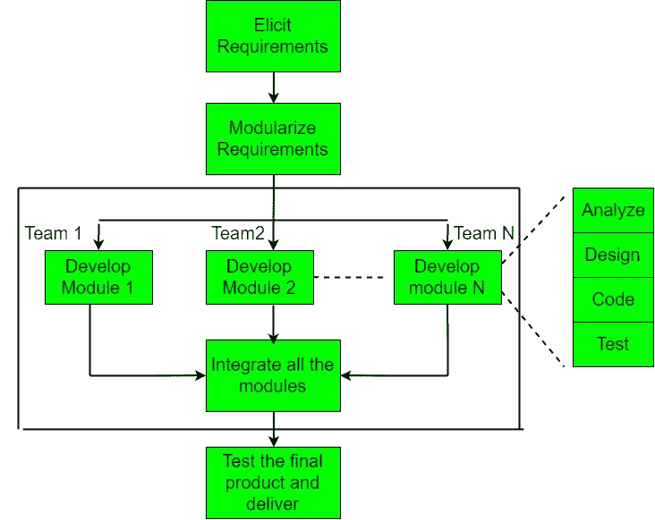

# 软件工程|快速应用开发模型(RAD)

> 原文:[https://www . geesforgeks . org/software-engineering-rapid-application-development-model-rad/](https://www.geeksforgeeks.org/software-engineering-rapid-application-development-model-rad/)

快速应用程序开发模型最早是由 IBM 在 20 世纪 80 年代提出的。这个模型的关键特征是使用了强大的开发工具和技术。

如果一个软件项目可以分解成小模块，每个模块可以独立分配给不同的团队，那么这个项目就可以用这个模型来实现。这些模块最终可以组合形成最终产品。

每个模块的开发都涉及瀑布模型中的各种基本步骤，即分析、设计、编码和测试等。如图所示。
这种模式的另一个显著特点是时间跨度短，即交货时限(时间框)一般为 60-90 天。

使用强大的开发工具，如 JAVA、C++、Visual BASIC、XML 等。也是项目不可分割的一部分。

该模型包括 4 个基本阶段:

1.  **需求计划–**
    它涉及到需求启发中使用的各种技术，如头脑风暴、任务分析、表单分析、用户场景、FAST(简化应用程序开发技术)等。它还包括描述关键数据的整个结构化计划、获取数据的方法，然后对其进行处理以形成最终的细化模型。
2.  **用户描述–**
    这个阶段包括获取用户反馈和使用开发人员工具构建原型。换句话说，它包括对第一阶段收集的数据进行重新检查和验证。数据集属性也在这个阶段被识别和阐明。
3.  **建设–**
    在这一阶段，进行原型的细化和交付。它包括实际使用强大的自动化工具将过程和数据模型转换成最终的工作产品。所有需要的修改和增强都在这个阶段完成了。
4.  **切换–**
    由不同团队开发的独立模块之间的所有接口都必须经过适当的测试。强大的自动化工具和子部分的使用使得测试更加容易。接下来是用户的验收测试。

这个过程包括建立一个快速原型，将其交付给客户，并收集反馈。经客户验证后，制定安全气囊系统文件，并最终确定设计。

**优势–**

*   使用可重用组件有助于减少项目的周期时间。
*   客户的反馈可在初始阶段获得。
*   降低成本，因为需要更少的开发人员。
*   使用强大的开发工具可以在相对较短的时间内产生更高质量的产品。
*   项目的进展和发展可以通过各个阶段来衡量。
*   由于迭代时间跨度短，更容易适应不断变化的需求。

**缺点–**

*   使用强大而高效的工具需要高技能的专业人员。
*   缺少可重用组件会导致项目失败。
*   团队领导必须与开发人员和客户密切合作，及时结束项目。
*   不能适当模块化的系统不能使用这种模型。
*   整个生命周期都需要客户的参与。
*   它并不适合小规模项目，因为在这种情况下，使用自动化工具和技术的成本可能会超过项目的全部预算。

**应用–**

1.  该模型应该用于具有已知需求并且需要短开发时间的系统。
2.  它也适用于需求可以模块化并且可重用组件也可用于开发的项目。
3.  当已经存在的系统组件可以用于开发具有最小变化的新系统时，也可以使用该模型。
4.  只有当团队由领域专家组成时，才能使用这个模型。这是因为相关知识和使用强大技术的能力是必要的。
5.  当预算允许使用所需的自动化工具和技术时，应选择模型。