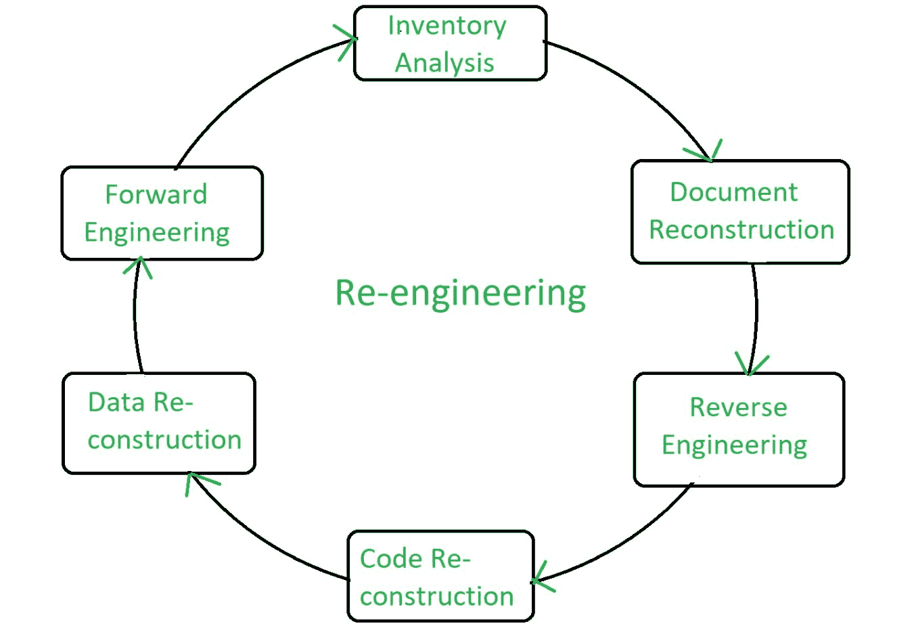

# 软件工程|重新设计

> 原文:[https://www . geesforgeks . org/software-engineering-re-engineering/](https://www.geeksforgeeks.org/software-engineering-re-engineering/)

**软件再工程**是为了提高软件系统的可维护性而进行的软件开发过程。重新设计是对一个系统进行检查和改造，以一种新的形式重新构建它。这个过程包括子过程的组合，如逆向工程、正向工程、重构等。

> 重新设计就是重组和修改现有的软件系统，使它们更容易维护。

**改造目标:**

*   描述一个系统进化的成本有效的选择。
*   描述软件维护过程中涉及的活动。
*   区分软件和数据重组，并解释数据重组的问题。

**重新设计涉及的步骤:**

1.  存储分析
2.  文档重建
3.  逆向工程
4.  代码重构
5.  数据重建
6.  前进工程

**图解表示:**

**重新设计成本因素:**

*   要重新设计的软件的质量
*   可用于重新设计的工具支持
*   所需数据转换的范围
*   重新设计的专家人员的可用性

**再造优势:**

*   **降低风险:**由于软件已经存在，与新软件开发相比，风险较小。开发问题、人员配备问题和规范问题是新软件开发中可能出现的许多问题。
*   **降低成本:**重新设计的成本小于开发新软件的成本。
*   **业务规则的揭示:**随着系统的重新设计，系统中嵌入的业务规则被重新发现。
*   **更好地利用现有员工:**在重新设计期间，现有员工的专业知识可以得到维护和扩展，以适应新的技能。

**再造的弊端:**

*   再设计范围的实际限制。
*   系统数据管理的主要架构变更或彻底重组必须手动完成。
*   重新设计的系统不太可能像使用现代软件重新设计方法开发的新系统那样可维护。