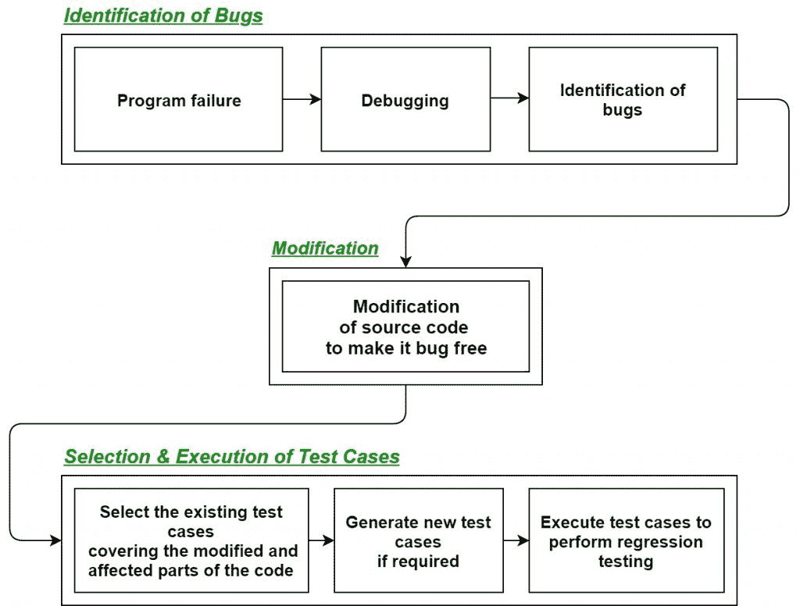
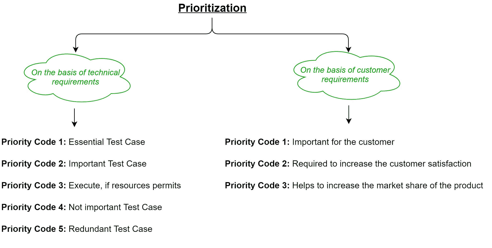

# 软件工程|回归测试

> 原文:[https://www . geesforgeks . org/软件-工程-回归-测试/](https://www.geeksforgeeks.org/software-engineering-regression-testing/)

**回归测试**是测试代码的修改部分和可能由于修改而受到影响的部分的过程，以确保在进行修改后软件中没有引入新的错误。回归意味着某种东西的回归，在软件领域，它指的是一个 bug 的回归。

**什么时候做回归测试？**

*   当一个新的功能被添加到系统中，并且代码被修改以吸收该功能并将其与现有代码集成时。
*   当在软件中发现一些缺陷，并调试代码来修复它时。
*   当修改代码以优化其工作时。

**回归测试的过程:**
首先，每当我们因为任何原因对源代码进行一些修改，比如增加新的功能、优化等。那么我们的程序在执行时会因为明显的原因在之前设计的测试套件中失败。失败后，调试源代码，以便识别程序中的错误。在识别源代码中的错误后，进行适当的修改。然后从已经存在的测试套件中选择合适的测试用例，该测试套件覆盖了源代码的所有修改和受影响的部分。如果需要，我们可以添加新的测试用例。最后，使用选定的测试用例执行回归测试。

**为回归测试选择测试用例的技术:**

*   **选择所有测试用例:**在这种技术中，所有的测试用例都是从已经存在的测试套件中选择的。这是最简单、最安全的技术，但效率不高。
*   **随机选择测试用例:**在这种技术中，测试用例是从现有的测试套件中随机选择的，但是只有当所有的测试用例的故障检测能力都一样好的时候才是有用的，这是非常罕见的。因此，在大多数情况下并不使用它。
*   **选择修改遍历测试用例:**在这种技术中，只选择那些覆盖和测试源代码的修改部分(受这些修改影响的部分)的测试用例。
*   **Select higher priority test cases:** In this technique, priority codes are assigned to each test case of the test suite based upon their bug detection capability, customer requirements, etc. After assigning the priority codes, test cases with highest priorities are selected for the process of regression testing.
    Test case with highest priority has highest rank. For example, test case with priority code 2 is less important than test case with priority code 1.

    

**回归测试的工具:**在回归测试中，我们通常从现有的测试套件本身中选择测试用例，因此，我们不需要计算它们的预期输出，并且由于这个原因，它可以很容易地自动化。自动化回归测试的过程将会非常有效和节省时间。
回归测试最常用的工具有:

*   硒
*   WATIR(红宝石中的网络应用测试)
*   QTP(快速测试专业人员)
*   理性功能测试者
*   Winrunner(游戏名)
*   丝绸检验

**回归测试的优势:**

*   它确保在向系统添加新功能后没有引入新的 bug。
*   因为回归测试中使用的大多数测试用例都是从现有的测试套件中选择的，并且我们已经知道它们的预期输出。因此，可以通过自动化工具轻松实现自动化。
*   它有助于保持源代码的质量。

**回归测试的缺点:**

*   如果不使用自动化工具，可能会耗费时间和资源。
*   即使在代码中做了很小的更改，也需要它。