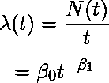
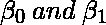
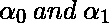

# 软件工程|可靠性增长模型

> 原文:[https://www . geesforgeks . org/软件-工程-可靠性-增长-模型/](https://www.geeksforgeeks.org/software-engineering-reliability-growth-models/)

可靠性增长模型组通过测试过程测量和预测可靠性计划的改进。增长模型将系统的可靠性或故障率表示为时间或测试用例数量的函数。该组中包括的型号如下。

1.  **Coutinho Model –**
    Coutinho adapted the Duane growth model to represent the software testing process. Coutinho plotted the cumulative number of deficiencies discovered and the number of correction actions made vs the cumulative testing weeks on log-log paper. Let N(t) denote the cumulative number of failures and let t be the total testing time. The failure rate, (t), the model can be expressed as

    

    其中为模型参数。最小二乘法可用于估计该模型的参数。

2.  **Wall and Ferguson Model –**
    Wall and Ferguson proposed a model similar to the Weibull growth model for predicting the failure rate of software during testing. The cumulative number of failures at time t, m(t), can be expressed as

    ![$m(t)=a_0[b(t)]^\beta $](img/3713b2b2ccef715e4a7bcfb3b16fe956.png "Rendered by QuickLaTeX.com")

    其中为未知参数。函数 b(t)可以作为测试用例的数量或总测试时间获得。类似地，时间 t 的故障率函数由下式给出

    ![$\lambda (t)= {m^' (t)} = {a_0\beta b^' (t){[b(t)]^{\beta -1}}}$](img/f1094bce66e186ea87ad628b3e99410f.png "Rendered by QuickLaTeX.com")

    Wall 和 Ferguson 使用几个软件故障数据测试了这个模型，并观察到故障数据与模型有很好的相关性。