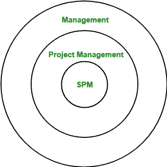
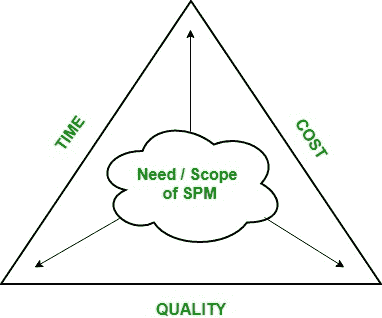

# 软件工程|软件项目经理职责

> 原文:[https://www . geesforgeks . org/software-engineering-of-software-project-manager/](https://www.geeksforgeeks.org/software-engineering-responsibilities-of-software-project-manager/)

[软件项目管理(SPM)](https://www.geeksforgeeks.org/software-engineering-software-project-management-spm/) 是项目管理的一个子领域，对软件项目进行计划、实施、监控和控制。

它由三个术语组成:软件、项目和管理。所以，让我们分别理解每个术语。软件包括一套特定软件项目的程序、文档和用户手册。因此，它基本上是从需求收集阶段开始，一直到测试和维护的软件开发的完整过程。项目是指由几个定义明确的任务组成的计划活动。管理层确保产品按计划生产。

软件项目有许多限制，但是主要的和基本的限制包括:时间、成本和质量。任何一个 twp 因素都会严重影响第三个。因此，软件项目管理对于在规定的时间和预算内开发高质量的软件项目至关重要。

**软件项目经理:**
软件项目经理通常从不直接参与最终产品的生产，但他控制和管理生产中涉及的活动。他知道软件开发生命周期的所有阶段，软件将经历这些阶段。

**软件项目经理职责:**

1.  **管理人员:**
    *   担任项目负责人
    *   与利益相关方的沟通
    *   人力资源经理
2.  **管理项目:**
    *   监控进度和绩效
    *   每个阶段的风险分析
    *   管理时间和预算限制

**软件项目分类:**

1.  **强制与自愿系统(项目):**
    *   强制系统是一个组织的员工如果想完成一项任务就必须使用的系统。
    *   自愿系统是用户自愿使用的系统，如计算机游戏、学校项目等。
2.  **信息 Vs 嵌入式系统(项目):**
    *   员工使用信息系统来执行办公流程和任务，例如库存控制系统。
    *   嵌入式系统用于控制机器，例如控制建筑物中设备的系统。
3.  **基于目标与基于产品的系统(项目):**
    *   项目的要求是满足某些目标，这些目标可以通过多种方式实现，这种项目是基于目标的项目。
    *   其要求是创建产品的项目，其细节已由客户指定，是基于产品的项目。