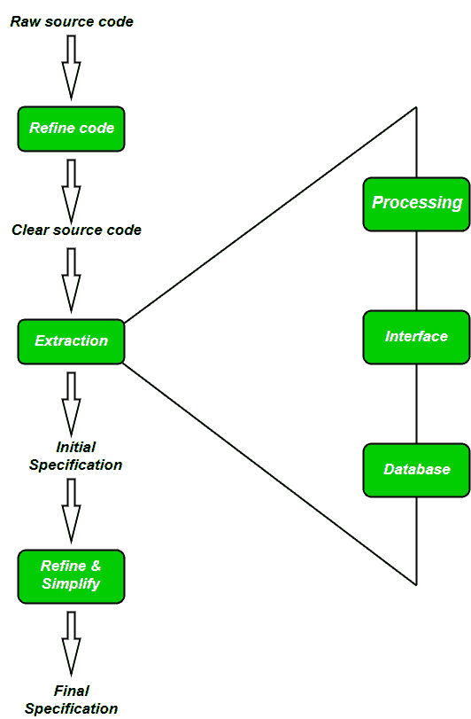

# 软件工程|逆向工程

> 原文:[https://www . geesforgeks . org/software-engineering-reverse-engineering/](https://www.geeksforgeeks.org/software-engineering-reverse-engineering/)

**软件逆向工程**是从对产品代码的分析中恢复产品的设计、需求规格和功能的过程。它建立一个程序数据库，并由此产生信息。

逆向工程的目的是通过提高系统的可理解性来促进维护工作，并为遗留系统生成必要的文档。

**逆向工程目标:**

*   应对复杂性。
*   恢复丢失的信息。
*   检测副作用。
*   综合更高的抽象。
*   促进重用。

**软件逆向工程的步骤:**

1.  **Collection Information:** 
    This step focuses on collecting all possible information (i.e., source design documents etc.) about the software. 
2.  **Examining the information:** 
    The information collected in step-1 as studied so as to get familiar with the system. 
3.  **Extracting the structure:** 
    This step concerns with identification of program structure in the form of structure chart where each node corresponds to some routine. 
4.  **Recording the functionality:** 
    During this step processing details of each module of the structure, charts are recorded using structured language like decision table, etc. 
5.  **Recording data flow:** 
    From the information exA tracted in step-3 and step-4, set of data flow diagrams are derived to show the flow of data among the processes. 
6.  **Recording control flow:** 
    High level control structure of the software is recorded. 
7.  **Review extracted design:** 
    Design document extracted is reviewed several times to ensure consistency and correctness. It also ensures that the design represents the program. 
8.  **Generate documentation:** 
    Finally, in this step, the complete documentation including SRS, design document, history, overview, etc. are recorded for future use. 

**逆向工程工具:**

如果手动进行逆向工程，将消耗大量时间和人力，因此必须由自动化工具支持。下面给出了一些工具:

*   **CIAO 和 CIA:** 软件和网络存储库的图形导航器，以及一系列逆向工程工具。
*   **Rigi:** 一个可视化的软件理解工具。
*   **Bunch:** 一款软件集群/模块化工具。
*   **GEN++:** 支持 C++语言分析工具开发的应用生成器。
*   **PBS:** 软件书架工具，用于提取和可视化程序的架构。