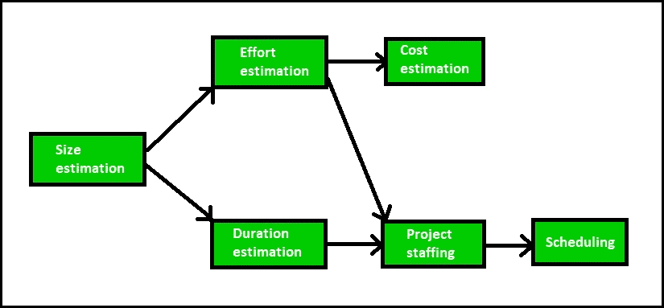

# 软件工程|软件项目经理的角色和职责

> 原文:[https://www . geesforgeks . org/软件工程-软件项目经理的角色和职责/](https://www.geeksforgeeks.org/software-engineering-role-and-responsibilities-of-a-software-project-manager/)

软件项目经理是团队中最重要的人，承担着管理软件项目的全部责任，在项目的成功完成中起着重要的作用。项目经理必须面对许多困难的情况才能完成这些工作。事实上，项目经理的工作职责范围从建立团队士气等无形活动到高度可见的客户演示。大多数经理负责撰写项目建议书、项目成本估算、进度安排、项目人员配备、软件流程定制、项目监控、软件配置管理、风险管理、管理报告撰写和提交以及与客户的沟通。项目经理的任务分为两大类:

1.  计划图编制
2.  项目监控

**项目规划**

项目规划在可行性研究阶段之后、需求分析和规范阶段开始之前立即进行。一旦发现项目可行，软件项目经理就开始项目规划。项目规划在任何开发阶段开始之前完成。项目规划包括估计项目的几个特征，然后根据这些估计规划项目活动。项目规划是以最大的细心和注意力完成的。错误的估计会导致进度延误。进度延迟会引起客户的不满，这可能会导致项目失败。对于有效的项目规划，除了非常好的各种估算技术的知识，过去的经验也是非常重要的。在项目规划期间，项目经理执行以下活动:

1.  **Project Estimation:** Project Size Estimation is the most important parameter based on which all other estimations like cost, duration and effort are made.
    *   **成本估算:**估算开发软件产品的总费用。
    *   **时间估算:**完成项目所需的总时间。
    *   **工作量估算:**估算完成项目所需的工作量。

    所有后续规划活动的有效性取决于这三种估计的准确性。

2.  **调度:**所有项目参数估算完成后，进行人力等资源调度。
3.  **人员配备:**制定团队结构和人员配备计划。
4.  **风险管理:**项目经理应识别项目开发风险过程中可能出现的意外风险，分析可能导致这些风险的损害，并采取风险降低计划来应对这些风险。
5.  **Miscellaneous plans:** This includes making several other plans such as quality assurance plan, configuration management plan, etc.

    规划活动的开展顺序如下图所示:
    

    **项目监控**

    一旦开发活动开始，就进行项目监控和控制活动。项目监控活动的主要重点是确保软件开发按计划进行。这包括检查项目是否按计划进行。如果出现任何问题，项目经理必须采取必要措施解决问题。

    **软件项目经理的角色:**在软件开发中，项目经理的角色有很多。

    *   **带领团队:**项目经理必须是一个优秀的领导者，他将不同技能的成员组成一个团队，并能完成他们各自的任务。
    *   **激励团队成员:**软件项目经理的关键角色之一是鼓励团队成员正确工作，以成功完成项目。
    *   **跟踪进度:**项目经理要时刻关注项目进度。项目经理必须跟踪项目是否按计划进行。如果出现任何问题，那么采取必要的行动来解决问题。此外，检查产品是否是通过维护正确的编码标准开发的。
    *   **联络员:**项目经理是开发团队和客户之间的纽带。项目经理分析客户需求并将其传达给开发团队，并不断向客户报告项目进度。此外，项目经理检查项目是否满足客户要求。
    *   **记录项目报告:**项目经理为将来准备项目的文件。这些报告包含产品和各种技术的详细特征。这些报告有助于在未来保持和提高项目质量。

    **软件项目经理必备技能:**要成为一名成功的项目经理，需要具备各种项目管理技术的良好理论知识，但仅有理论知识是不够的。此外，项目经理必须具有良好的决策能力、良好的沟通技巧和控制团队成员的能力，与他们保持良好的关系，并有能力完成他们的工作。需要一些技能，如跟踪和控制项目进度、客户互动、良好的评估技术知识和以往的经验。

    成为成功的项目经理最重要的技能如下:

    *   了解项目评估技术
    *   在正确的时间有良好的决策能力
    *   以前管理类似项目的经验
    *   良好的沟通技巧，以满足客户的满意度
    *   项目经理必须鼓励所有团队成员成功开发产品
    *   他必须知道可能发生的各种类型的风险以及这些问题的解决方案