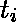
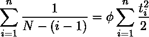
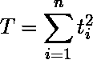

# 软件工程| Schick-Wolverton 软件可靠性模型

> 原文:[https://www . geesforgeks . org/software-engineering-schick-wolverton-software-reliability-model/](https://www.geeksforgeeks.org/software-engineering-schick-wolverton-software-reliability-model/)

先决条件–[杰林斯基·莫兰达软件可靠性模型](https://www.geeksforgeeks.org/software-engineering-jelinski-moranda-software-reliability-model/)
谢克-沃尔弗顿(S-W)模型是对 J-M 模型的修改。它类似于 J-M 模型，只是它进一步假设第 I 个时间间隔的故障率随着自上次调试以来的时间 ti 而增加。在该模型中，第 i-1 次和第 I 次故障之间的程序故障率函数可以表示为

![$\lambda (t_i)=\phi [N-(i-1)]t_i$](img/e553c3c324d3cd2b7842f839cf47ad6b.png "Rendered by QuickLaTeX.com")

其中和 N 与 J-M 模型中定义的相同，ti 为第(i-1)次故障后的测试时间。

的 pdf(概率分布函数)可以得到如下:

![$f(t_i)=\phi [N-(i-1)]t_ie^{\frac{[N-(i-1)]t_i^2}{2}} \; \; for \;i=1, 2, ..., N$](img/a0b9bd0cc2d41c01e7894467d2037695.png "Rendered by QuickLaTeX.com")

因此，软件可靠性功能是

![$R(t_i)=e^{- \int_0^{t_i} \lambda (t_i)dt_i }$ $=e^{-\frac{\phi [N-(i-1)]t_i^2}{2}}$ ](img/ad42459b80916b7ed7fca00fa1331aed.png "Rendered by QuickLaTeX.com")

我们现在希望估计 N，假设给定。使用最大似然法，对数似然函数由下式给出:

![ $ln L(N) &=ln\left \{ \prod_{i=1}^nf(t_i)\right \}\\$ $&=ln\left \{ \prod_{i=1}^n\left [ \phi [N-(i-1)]t_ie^{\frac{[N-(i-1)]t_i^2}{2}\right ]\right \}\\$ $&=nln\phi + \sum_{i=1}^nln[N-(i-1)]+\sum_{i=1}^nlnt_i-\sum_{i=1}^n\phi [N-(i-1)]\frac{t_i^2}{2}\\$ $ ](img/1da0c12547a7bfeaf98b536b82a64973.png "Rendered by QuickLaTeX.com")

取 N 的一阶导数，我们有，

![$ \frac{\partial}{\partial N}[ln L(N)]=\sum_{i=1}^n \frac{1}{N-(i-1)}-\phi \sum_{i=1}^n \frac{t_i^2}{2}=0 $](img/7e54aa6e1172b28a683375a317579ca2.png "Rendered by QuickLaTeX.com")

因此，N 的最大似然估计可以通过求解以下方程获得:

接下来，我们假设 N 和？都是未知的。因此我们得到，

![$\frac{\partial}{\partial \phi}[ln L(N, \phi )]=\sum_{i=1}^n \frac{1}{N-(i-1)}-\phi \sum_{i=1}^n \frac{t_i^2}{2}=0$](img/977b6eb217ffa32e3ec71fde4a75cb74.png "Rendered by QuickLaTeX.com")

和

![$\frac{\partial}{\partial \phi}[ln L(N, \phi )]=\frac{n}{\phi }-\sum_{i=1}^n [N-(i-1)]\frac{t_i^2}{2}=0$](img/73b879c0b6afa40059bf0aa53facd9c0.png "Rendered by QuickLaTeX.com")

因此，N 和的最大似然估计可以通过同时求解如下两个方程得到:

![$\phi = 2\sum_{i=1}^n \frac{1}{[N-(i-1)]T}$ $N=\frac{2n}{\phi T}+\frac{\sum_{i=1}^n (i-1)t_i^2}{T}$ ](img/6f0dba0f015be445a15771147a802812.png "Rendered by QuickLaTeX.com")

在哪里

