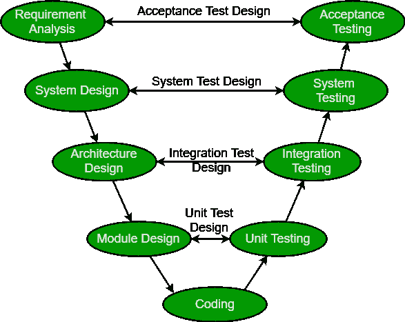

# 软件工程| SDLC V 型

> 原文:[https://www . geesforgeks . org/software-engineering-SDLC-v-model/](https://www.geeksforgeeks.org/software-engineering-sdlc-v-model/)

V 型模型是一种 SDLC 模型，其中流程以 V 型顺序执行。它也被称为验证和确认模型。它基于每个相应开发阶段的测试阶段的关联。与测试阶段直接相关的每个步骤的开发。下一个阶段只有在前一个阶段完成之后才开始，也就是说，对于每个开发活动，都有一个与之对应的测试活动。

**验证:**涉及不执行代码完成的静态分析技术(评审)。它是对产品开发阶段进行评估的过程，以发现规定的要求是否满足。

**验证:**它涉及动态分析技术(功能性、非功能性)，通过执行代码完成测试。验证是在开发阶段完成后评估软件的过程，以确定软件是否满足客户的期望和要求。

所以 V-Model 的一边包含验证阶段，另一边包含验证阶段。验证和确认阶段由 V 形编码阶段连接。因此被称为 V 型。

**设计阶段:**

*   **需求分析:**此阶段包含与客户的详细沟通，以了解他们的需求和期望。这个阶段被称为需求收集。
*   **系统设计:**此阶段包含系统设计和开发产品所需的完整硬件和通信设置。
*   **架构设计:**系统设计被进一步分解为采用不同功能的模块。内部模块之间以及与外部世界(其他系统)之间的数据传输和通信清晰明了。
*   **模块设计:**在这个阶段，系统将 dowm 分解成小模块。规定了模块的详细设计，也称为低级设计。

**测试阶段:**

*   **单元测试:**单元测试计划在模块设计阶段制定。执行这些单元测试计划是为了消除代码或单元级别的错误。
*   **集成测试:**单元测试完成后，进行集成测试。在集成测试中，模块被集成，系统被测试。集成测试在架构设计阶段执行。该测试验证了模块之间的通信。
*   **系统测试:**系统测试测试完整的应用程序及其功能、相互依赖和通信。它测试开发的应用程序的功能性和非功能性需求。
*   **用户验收测试(UAT):** UAT 在类似于生产环境的用户环境中执行。UAT 验证交付的系统满足用户的要求，并且系统已准备好在现实世界中使用。

**工业挑战领域:**随着行业的发展，技术变得更加复杂，速度越来越快，并且永远在变化，然而，仍然有一套基本原则和概念在今天仍然适用，就像信息技术刚刚起步时一样。

*   准确定义和细化用户需求。
*   根据授权用户的要求设计和构建应用程序。
*   验证他们构建的应用程序符合授权的业务需求。

**V 型原理:**

*   **从大到小:**在 V-Model 中，测试是以分层的视角进行的，例如，项目团队确定的需求，创建项目的高级设计和详细设计阶段。随着每个阶段都完成了需求，它们的定义变得越来越精细和详细。
*   **数据/流程完整性:**该原则指出，任何项目的成功设计都需要数据和流程的结合和衔接。必须在每个需求中识别过程元素。
*   **可伸缩性:**该原则声明 V-Model 概念具有适应任何 IT 项目的灵活性，无论其规模、复杂性或持续时间如何。
*   **交叉引用:**需求和相应测试活动之间的直接关联称为交叉引用。
*   **有形文档:**这个原则说明每个项目都需要创建一个文档。项目开发团队和支持团队都需要并应用该文档。文档用于在应用程序在生产环境中可用时对其进行维护。

**为什么首选？**

*   由于模型的刚性，很容易管理。V-Model 的每个阶段都有特定的交付成果和审查流程。
*   主动缺陷跟踪——即在早期发现缺陷。

**什么时候用？**

*   需求被明确定义和固定。
*   当有足够的技术资源和技术专长时，使用 V 型。

**优势:**

*   这是一个高度规范的模型，每个阶段一次完成一个。
*   V-Model 用于项目需求明确的小型项目。
*   简单易懂，易于使用。
*   该模型关注生命周期早期的验证和确认活动，从而提高构建无错误且高质量产品的可能性。
*   它使项目管理能够准确地跟踪进度。

**缺点:**

*   高风险和不确定性。
*   对于复杂和面向对象的项目来说，这不是一个好主意。
*   不适合需求不明确、变更风险高的项目。
*   这个模型不支持阶段的迭代。
*   它不容易处理并发事件。