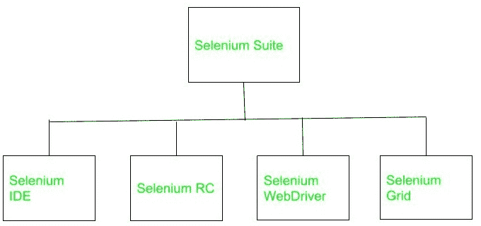
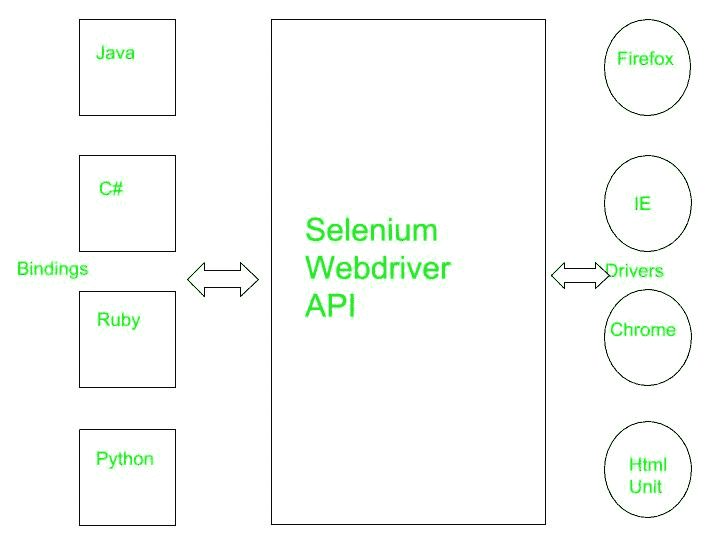
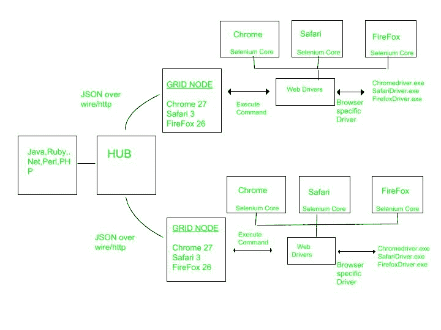

# 软件工程|硒:一个自动化工具

> 原文:[https://www . geesforgeks . org/software-engineering-selenium-an-automation-tool/](https://www.geeksforgeeks.org/software-engineering-selenium-an-automation-tool/)

Selenium 是一个自动化工具和便携式软件测试工具，用于 web 应用程序。还提供了特定于测试领域的语言，要编写测试用例，可以使用编程语言，包括 C#、Java、Perl、PHP、Python、Ruby、Scala、Groovy。它不支持诸如 Silverlight JavaFX 和 Flex\Flash 之类的 RIA(富互联网应用)技术。硒不是单一的工具。它是由以下组件组成的软件产品套件:

**历史:**硒是杰森·哈金斯于 2004 年在 ThoughtWorks 开发的。一段时间后，他注意到不用手动测试他的应用程序，他可以自动化他的测试。他开发了一个 JavaScript 程序来测试他的网络应用程序，允许他自动重新运行测试。他称自己的程序为“JavaScriptTestRunner”。过了一段时间，这个工具被开源并改名为 Selenium Core。
硒遥控器是保罗·汉曼开发的。开发 Selenium RC 背后的原因是，使用 Selenium core 的测试人员必须在他们的本地计算机上安装整个被测应用程序和网络服务器，因为有一些由相同的原始策略强制实施的限制。为了克服这个限制，保罗·汉曼特做出了一个决定，他开发了一个服务器，这个服务器将作为一个 HTTP 代理来欺骗网络浏览器，因此他认为 Selenium Core 和被测试的网络应用程序来自同一个域。
硒 IDE 由日本 Shinya Kasatani 研发。它是作为火狐插件实现的，现在我们可以在每个网络浏览器上使用硒集成开发环境。他在 2006 年给硒项目提供了硒 IDE。
硒网格由 Philippe Hanrigou 于 2008 年开发。它是一个允许测试使用运行在远程机器上的 web 浏览器实例的服务器。它提供了在远程网络浏览器上运行测试的能力，这有助于在多台机器上分配测试负载，并且将节省大量时间。它允许跨不同平台和操作系统执行并行测试。作为开源，网格为 Selenium RC 提供了类似于私有谷歌云的功能。Pat Lightbody 已经制作了一个名为“HostedQA”的私有云系统，并将其出售给了 Gomez，Inc.
Selenium WebDriver 是由 Simon Stewart 在 2006 年开发的。网络驱动程序自动控制由网络浏览器启动的程序。它不依赖 JavaScript 来实现自动化。它通过与浏览器通信来直接控制浏览器。这是第一个可以从操作系统层面控制浏览器的跨平台测试框架。
2009 年，经过一次会议，整个 Selenium 团队决定将 Selenium RC 和 WebDriver 这两个项目合并，称之为 Selenium 2.0。

**Selenium IDE:** 最开始 Selenium IDE(集成开发环境)是作为火狐插件/插件实现的，现在可以在每个网页浏览器上使用 Selenium IDE。它提供记录和回放功能。图为 Selenium IDE。
T3】

**优点:**

*   它是一个开源工具。
*   为扩展提供基础。
*   它提供多浏览器支持。
*   使用硒集成开发环境时不需要编程语言经验。
*   用户可以设置断点并进行调试。
*   它提供记录和回放功能。

cons:t1]

*   没有支持迭代和条件操作。
*   执行缓慢。
*   它没有任何 API。
*   它不提供任何错误处理机制。

**硒 RC:** RC 代表遥控。它允许程序员用不同的编程语言进行编码，如 C#、Java、Perl、PHP、Python、Ruby、Scala、Groovy。该图显示了远程控制服务器的工作原理。
T3】

**优点:**

*   它支持所有的网络浏览器。
*   它可以执行迭代和条件运算。
*   与集成开发环境相比，执行速度更快。
*   它有内置的测试结果生成器。
*   它支持数据驱动测试。
*   它有一个成熟完整的 API。

cons:t1]

*   需要编程语言知识。
*   它不支持对 IOS/Android 的测试。
*   就执行而言，它比 Selenium 网络驱动程序慢一点。
*   它不支持录音和回放功能。
*   复杂的配置。

**Selenium Web Driver:**Selenium Web Driver 自动执行并控制由 Web 浏览器启动的操作。它不依赖 JavaScript 来实现自动化。它通过与浏览器通信来直接控制浏览器。该图显示了网络驱动程序如何作为驱动程序和绑定
之间的接口工作

**优点:**

*   它直接与网络浏览器通信。
*   执行速度更快。
*   它支持监听器。
*   支持 IOS/安卓应用测试。
*   安装比 Selenium RC 简单。
*   纯粹面向对象。

cons:t1]

*   它需要编程知识。
*   没有生成测试结果文件的内置机制。

**Selenium Grid:** 基本上，它是一个允许测试使用运行在远程机器上的 web 浏览器实例的服务器。它提供了在远程网络浏览器上运行测试的能力，这有助于在多台机器上分配测试负载，并且将节省大量时间。它允许跨不同平台和操作系统执行并行测试。

硒电网是一个由 HUB &节点组成的网络。每个节点以特定的配置注册到 HUB，HUB 知道该节点上可用的浏览器。当一个特定浏览器(具有所需功能对象)的请求到达 HUB 时，HUB 如果发现与所请求的网络浏览器匹配，则将调用重定向到该特定网格节点，然后双向建立会话并开始执行。