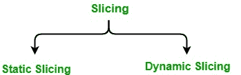

# 软件工程|切片

> 原文:[https://www.geeksforgeeks.org/software-engineering-slicing/](https://www.geeksforgeeks.org/software-engineering-slicing/)

**切片**或程序切片是软件测试中使用的一种技术，它获取程序中的一个切片或一组程序语句，用于测试特定的测试条件或情况，并可能影响特定兴趣点的值。它也可以用于调试的目的，以便更容易和更快地发现错误。

切片技术最初是由马克·魏泽定义的，当时它们只是静态的。后来，波格丹一世·科雷尔和贾努斯·拉斯基引入了动态切片，这可以用于程序的特定执行。

它有两种类型:静态切片和动态切片，解释如下:



**1。静态切片:**

*   一个程序的静态切片包含所有的语句，这些语句可能会在程序任意执行的任何时候影响变量值。
*   静态切片通常较大。
*   它考虑程序的每一个可能的执行。

**2。动态切片:**

*   程序的动态切片包含在程序的特定执行过程中任何时候实际影响变量值的所有语句。
*   动态切片通常较小。
*   仅考虑程序的特定执行。

让我们通过给定的代码片段来看一个例子:

```
int z = 10;
int n;
cin >> n;
int sum = 0;
if (n > 10)
    sum = sum + n;
else
    sum = sum - n;
cout << "Hey";
```

变量**和**的静态切片:

```
int n;
cin >> n;
int sum = 0;
if (n > 10)
    sum = sum + n;
else
    sum = sum - n;
```

当 n = 22 时，变量**和**的动态切片；

```
int n;
cin >> n;
int sum = 0;
if (n > 10)
    sum = sum + n;
```

正如在上面的例子中可以观察到的，静态切片采取了程序的所有可能的执行(在这种情况下是 2)，这可能影响变量**和**的值。而在动态切片的情况下，它只考虑程序的特定执行(当 n = 22 时)，这可能影响变量**和**的值。
因此，动态切片总是比静态切片小。