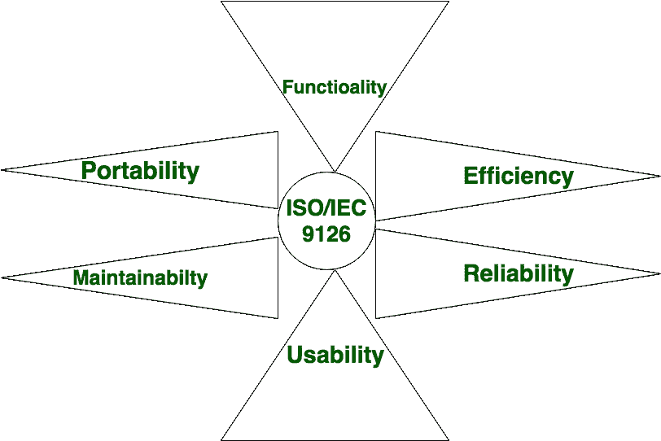
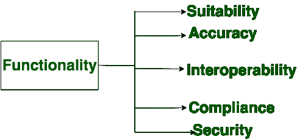
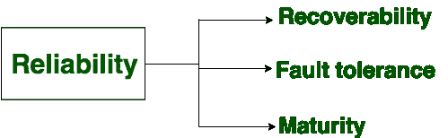
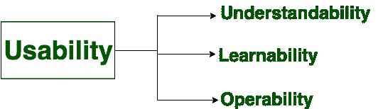
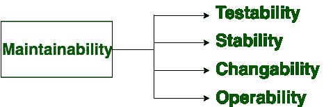
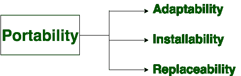

# 软件工程|软件特性

> 原文:[https://www . geesforgeks . org/software-engineering-software-features/](https://www.geeksforgeeks.org/software-engineering-software-characteristics/)

**软件**定义为计算机程序、程序、规则和数据的集合。软件特性分为六个主要部分:

这些组件描述如下:

*   **Functionality:** 
    It refers to the degree of performance of the software against its intended purpose. 

    所需功能有:

*   **Reliability:** 
    A set of attributes that bears on the capability of software to maintain its level of performance under the given condition for a stated period of time. 

    所需功能有:

*   **Efficiency:** 
    It refers to the ability of the software to use system resources in the most effective and efficient manner. The software should make effective use of storage space and executive command as per desired timing requirements. 

    所需功能有:

*   **Usability:** 
    It refers to the extent to which the software can be used with ease. the amount of effort or time required to learn how to use the software. 

    所需功能有:

*   **Maintainability:** 
    It refers to the ease with which the modifications can be made in a software system to extend its functionality, improve its performance, or correct errors. 

    所需功能有:

*   **Portability:** 
    A set of attributes that bears on the ability of software to be transferred from one environment to another, without or minimum changes. 

    所需功能有:

### 除了上面提到的软件质量，这里还有软件工程中软件的各种特性:

*   **软件开发或工程化；不是经典意义上的制造:**
    *   虽然软件开发和硬件制造之间存在一些相似之处，但很少有活动是根本不同的。
    *   在这两种活动中，高质量是通过良好的设计实现的，但是硬件的制造阶段会比软件引入质量问题。
*   **软件不会“磨损”:**
    *   硬件组件受到许多其他环境因素越来越大的影响。简单地说，硬件开始磨损。
    *   软件不容易受到导致硬件磨损的环境疾病的影响。
    *   当一个硬件组件磨损时，它会被一个备件替换。
    *   没有软件备件。
    *   每一个软件故障都表明设计中的一个错误，或者是设计被翻译成机器可执行代码的过程中的一个错误。因此，适应变更请求的软件维护任务比硬件维护复杂得多。然而，言外之意很明显——软件不会磨损。但它确实恶化了。
*   **软件继续定制:**
    *   一个软件部分应该以在各种项目中重用为目标来计划和执行。
    *   当前的可重用片段封装了这两个信息以及应用于信息的准备工作，使程序员能够从可重用的部分中创建新的应用程序。
    *   在硬件领域，组件重用是工程过程中自然的一部分。