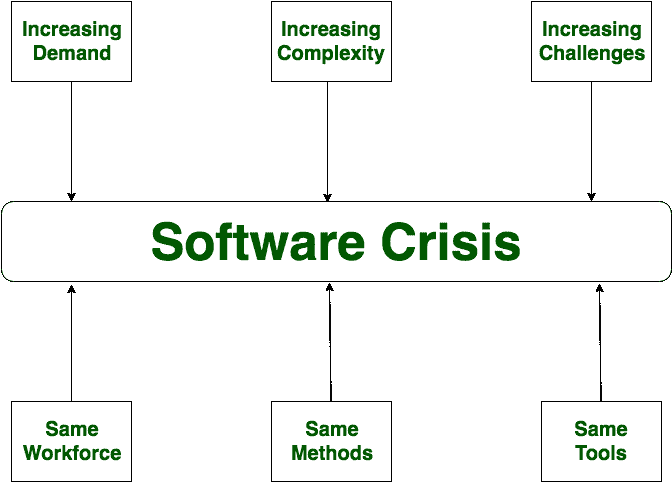

# 软件工程|软件危机

> 原文:[https://www . geesforgeks . org/software-engineering-software-crisis/](https://www.geeksforgeeks.org/software-engineering-software-crisis/)

**软件危机**是计算机科学中使用的一个术语，用于描述在要求的时间内编写有用且高效的计算机程序的难度。软件危机是由于使用相同的劳动力、相同的方法、相同的工具，尽管软件需求、软件复杂性和软件挑战在迅速增加。随着软件复杂性的增加，由于现有方法的不足，出现了许多软件问题。

如果在软件需求、软件复杂性和软件挑战快速增长之后，我们使用同样的劳动力、同样的方法和同样的工具，那么就会出现软件预算问题、软件效率问题、软件质量问题、软件管理和交付问题等问题。这种情况被称为软件危机。

**软件危机原因:**

*   拥有和维护软件的成本和开发软件一样昂贵
*   当时，项目正在超时运行
*   那时软件效率很低
*   软件质量低
*   软件经常不符合要求
*   一般的软件项目超出其进度一半
*   那时，软件从未交付

**软件危机的解决方案:**
危机没有单一的解决方案。软件危机的一个可能的解决方案是*软件工程*，因为软件工程是一个系统的、有纪律的和可量化的方法。为了防止软件危机，有一些准则:

*   减少软件超预算
*   软件的质量必须高
*   软件项目所需的时间更少
*   有软件项目团队成员工作经验
*   软件必须交付