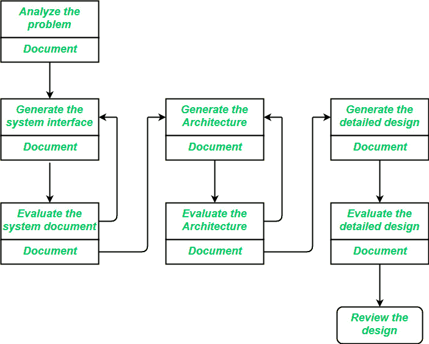

# 软件工程|软件设计流程

> 原文:[https://www . geesforgeks . org/software-engineering-software-design-process/](https://www.geeksforgeeks.org/software-engineering-software-design-process/)

软件开发的设计阶段处理将 SRS 文档中描述的客户需求转换成可使用编程语言实现的形式。
软件设计过程可以分为以下三个层次的设计阶段:

1.  接口设计
2.  建筑设计
3.  详细设计

**界面设计:**
*界面设计*是系统与其环境交互的规范。这个阶段相对于系统的内部工作在较高的抽象层次上进行，即在界面设计期间，系统的内部被完全忽略，系统被视为一个黑盒。注意力集中在目标系统与其交互的用户、设备和其他系统之间的对话上。在问题分析步骤中产生的设计问题陈述应确定人员、其他系统和设备，统称为*代理*。

界面设计应包括以下细节:

*   环境中事件的精确描述，或系统必须响应的来自代理的消息。
*   系统必须产生的事件或消息的精确描述。
*   数据的规格，以及进出系统的数据格式。
*   传入事件或消息与传出事件或输出之间的顺序和时序关系的规范。

**建筑设计:**
*建筑设计*是对一个系统的主要组件、它们的职责、属性、接口以及它们之间的关系和交互的规范。在建筑设计中，选择了系统的整体结构，但忽略了主要组件的内部细节。

建筑设计中的问题包括:

*   将系统分解成主要组件。
*   将职能职责分配给组件。
*   组件接口
*   组件缩放和性能属性、资源消耗属性、可靠性属性等等。
*   组件之间的通信和交互。

架构设计增加了在界面设计中忽略的重要细节。在设计的最后阶段，主要部件的内部设计被忽略。

**详细设计:**
*设计*是所有主要系统组件的内部元素、它们的属性、关系、处理的规范，通常还有它们的算法和数据结构。

详细设计可能包括:

*   将主要系统组件分解成程序单元。
*   单位职能职责的分配。
*   用户界面
*   单位状态和状态变化
*   单元之间的数据和控制交互
*   数据打包和实施，包括计划元素的范围和可见性问题
*   算法和数据结构