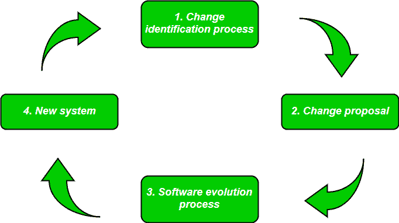

# 软件工程|软件进化

> 原文:[https://www . geesforgeks . org/software-engineering-software-evolution/](https://www.geeksforgeeks.org/software-engineering-software-evolution/)

**软件进化**是一个术语，指的是最初开发软件，然后由于各种原因及时更新软件的过程，即添加新功能或删除过时的功能等。演进过程包括变更分析、发布计划、系统实施和向客户发布系统的基本活动。

访问这些变更的成本和影响，以查看系统受变更影响的程度，以及实施变更的成本。如果提议的变更被接受，则计划软件系统的新版本。在发布计划期间，所有提议的变更(故障修复、调整和新功能)都被考虑在内。

然后进行设计，在系统的下一个版本中实现哪些更改。变更实施的过程是开发过程的迭代，在此过程中，系统的修订被设计、实施和测试。

**<u>软件进化的必要性</u> :** 软件评估之所以必要，只是因为以下几个原因:

**a) <u>需求随时间的变化</u> :** 随着时间的推移，组织的需求和工作方式可能会发生实质性的变化，因此在这个频繁变化的时间里，他们所使用的工具(软件)需要改变，以最大限度地提高绩效。

**b) <u>环境变化</u> :** 随着工作环境的变化，使我们能够在该环境中工作的事物(工具)也相应地发生变化随着工作环境的变化，软件世界也会发生同样的情况，组织需要重新引入具有更新特性和功能的旧软件来适应新环境。

**c) <u>错误和 bug</u>:**随着组织内部署的软件的年龄增长，它们的精确性或完美性降低，并且承受日益复杂的工作负载的效率也不断降低。因此，在这种情况下，有必要避免使用过时的软件。所有这些过时的软件都需要经历进化过程，以便根据当前环境的工作负载复杂性变得健壮。

**d) <u>安全风险</u> :** 在组织内使用过时的软件可能会导致您处于各种基于软件的网络攻击的边缘，并可能暴露您与正在使用的软件非法关联的机密数据。因此，有必要通过定期评估软件中使用的安全补丁/模块来避免此类安全漏洞。如果软件不够健壮，无法承受当前发生的网络攻击，那么必须对其进行更改(更新)。

**e) <u>为了拥有新的功能和特性</u> :** 为了提高性能和快速数据处理以及其他功能，组织需要在软件的整个生命周期中不断演进软件，以便产品的利益相关方&客户能够高效工作。

**用于软件进化的法则:**

1.  **持续变化定律:**
    该定律指出，任何代表现实世界的软件系统都会经历持续的变化，或者在这种环境中变得越来越没用。
2.  **复杂度递增定律:**
    随着一个不断进化的程序发生变化，它的结构变得更加复杂，除非做出有效的努力来避免这种现象。
3.  **组织稳定性守恒定律:**
    在一个程序的生命周期内，该程序的开发速度大约是恒定的，并且与专用于系统开发的资源无关。
4.  **熟悉度守恒定律:**
    该定律指出，在程序的活动寿命期间，在连续发布中所做的更改几乎是恒定的。