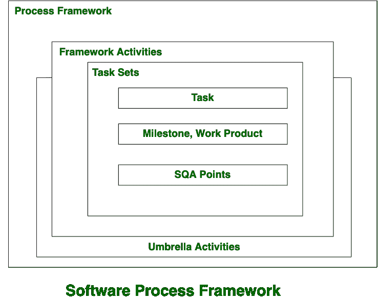

# 软件工程|软件过程框架

> 原文:[https://www . geesforgeks . org/software-engineering-software-process-framework/](https://www.geeksforgeeks.org/software-engineering-software-process-framework/)

**框架**是构建和部署应用程序的标准方式。**软件过程框架**是完整软件工程过程的基础。软件过程框架包括所有总括活动的集合。它还包括许多适用于所有软件项目的框架活动。

通用流程框架包含五项活动，下面逐一给出:

1.  **沟通:**
    在本次活动中，与客户和其他利益相关方进行了大量的沟通，以及需求收集。
2.  **计划:**
    在本次活动中，我们讨论了技术相关任务、工作进度、风险、所需资源等。
3.  **建模:**
    建模是关于在‘现实世界’中构建事物的表示。在建模活动中，创建产品的模型是为了更好地理解需求。
4.  **构造:**
    在软件工程中，构造是组装产品所需的一套程序的应用。在本活动中，我们生成代码并测试产品，以制造更好的产品。
5.  **部署:**
    在本活动中，向客户展示完整或不完整的产品或软件，以进行评估并给出反馈。根据他们的反馈，我们修改产品以提供更好的产品。

**雨伞活动包括:**

*   风险管理
*   软件质量保证(SQA)
*   软件配置管理
*   尺寸
*   正式技术审查(FTR)