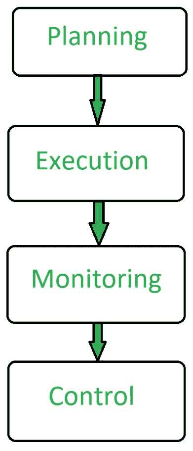

# 软件工程|软件项目管理(SPM)

> 原文:[https://www . geesforgeks . org/software-engineering-software-project-management-SPM/](https://www.geeksforgeeks.org/software-engineering-software-project-management-spm/)

**软件项目管理(SPM)** 是规划和领导软件项目的恰当方式。它是项目管理的一部分，在项目管理中，软件项目被计划、实施、监控和控制。

**软件项目管理的需求:**
软件是非实物产品。软件开发是商业中的一个新领域，在构建软件产品方面几乎没有经验。大多数软件产品都是为满足客户需求而制造的。最重要的是，基础技术变化和进步如此频繁和迅速，以至于一种产品的经验可能无法应用于另一种产品。这种类型的业务和环境限制增加了软件开发的风险，因此有效地管理软件项目至关重要。

组织必须交付高质量的产品，将成本控制在客户的预算范围内，并按计划交付项目。因此，软件项目管理有必要将用户需求与预算和时间限制结合起来。

**软件项目管理包括几种不同类型的管理:**

1.  **Conflict Management:**
    Conflict management is the process to restrict the negative features of conflict while increasing the positive features of conflict. The goal of conflict management is to improve learning and group results including efficacy or performance in an organizational setting. Properly managed conflict can enhance group results.
2.  **Risk Management:**
    Risk management is the analysis and identification of risks that is followed by synchronized and economical implementation of resources to minimize, operate and control the possibility or effect of unfortunate events or to maximize the realization of opportunities.
3.  **Requirement Management:**
    It is the process of analyzing, prioritizing, tracing and documenting on requirements and then supervising change and communicating to pertinent stakeholders. It is a continuous process during a project.
4.  **Change Management:**
    Change management is a systematic approach for dealing with the transition or transformation of an organization’s goals, processes or technologies. The purpose of change management is to execute strategies for effecting change, controlling change and helping people to adapt to change.
5.  **Software Configuration Management:**
    Software configuration management is the process of controlling and tracing changes in the software, part of the larger cross-disciplinary field of configuration management. Software configuration management include revision control and the inauguration of baselines.
6.  **发布管理:**
    发布管理是在部署发布时计划、控制和调度构建的任务。发布管理确保组织交付客户所需的新的和增强的服务，同时保护现有服务的完整性。

**软件项目管理方面:**

**软件项目管理优势:**

*   它有助于规划软件开发。
*   软件开发的实现变得容易。
*   监控是软件项目管理的一个方面。
*   它总体上能够节省软件开发的时间和成本。