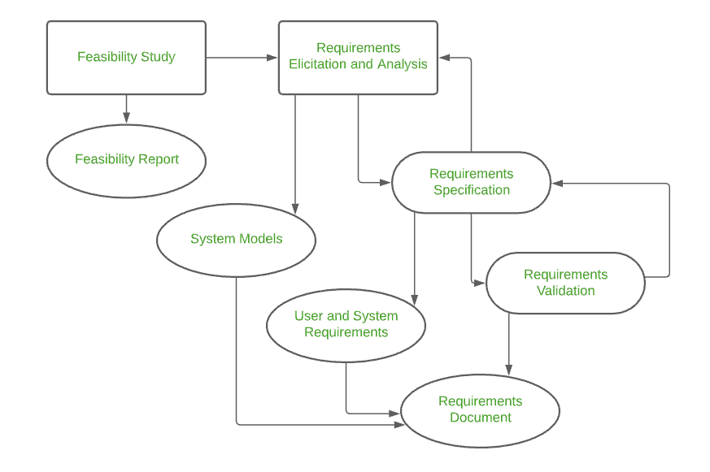

# 软件工程-软件需求任务

> 原文:[https://www . geesforgeks . org/software-engineering-software-request-tasks/](https://www.geeksforgeeks.org/software-engineering-software-requirement-tasks/)

需求工程是一个广泛的领域，它专注于成为建模、分析、设计和构建之间的连接器。它是在软件工程设计过程中定义、识别、管理和开发需求的过程。这个过程使用工具、方法和原则来描述系统的行为和随之而来的约束。

[需求工程](https://www.geeksforgeeks.org/software-engineering-requirements-engineering-process/)是每个业务必须遵循的最重要的部分，为了成功地构建和发布一个项目，因为它是关键规划和实施的基础。

需求工程过程

**需求工程任务:**软件需求工程过程包括以下活动步骤:

1.  **初始**
2.  **启发**
3.  **细化**
4.  **谈判**
5.  **规格**
6.  **验证**
7.  **需求管理**

让我们详细讨论这些步骤。

**1。初始阶段:**这是需求分析过程的第一阶段。这个阶段给出了如何开始一个项目的大纲。在开始阶段，所有的基本问题都是问如何着手一项任务或完成一项任务所需的步骤。获得了对问题的基本理解，并解决了解决方案的本质。有效的沟通在这个阶段非常重要，因为这个阶段是决定下一步要做什么的基础。总的来说，在初始阶段，软件工程师必须满足以下标准:

*   对问题的理解。
*   想要解决方案的人。
*   解决方案的性质。
*   客户和开发人员之间的沟通和协作。

**2。启发:**这是需求分析过程的第二阶段。这个阶段的重点是从涉众那里收集需求。在这个阶段应该小心，因为需求是建立项目关键目的的基础。对于开发人员来说，了解客户需要的需求类型是非常重要的。在这个过程中，错误可能发生在，没有实现正确的需求或者忘记了某个部分。正确的人必须参与这个阶段。在启发阶段可能会出现以下问题:

*   **范围问题:**给定的需求细节不必要、定义不明确或无法实现。
*   **理解问题:**在提出需要的需求时，开发人员和客户之间没有明确的理解。有时候，客户可能不知道他们想要什么，或者开发人员可能会对另一个需求产生误解。
*   **波动性问题:**需求随着时间的推移而变化，会给领导一个项目带来困难。这会导致资源和时间的损失和浪费。

**3。细化:**这是需求分析过程的第三阶段。这个阶段是开始和启发阶段的结果。在精化过程中，它将前两个阶段已经陈述和收集的需求进行提炼。扩展和深入研究也完成了。这一阶段的主要任务是沉迷于建模活动，并使用必要的工具和功能开发一个详细说明特性和约束的原型。

**4。协商:**这是需求分析流程的第四阶段。这个阶段强调讨论和交流，讨论什么是需要的，什么是需要消除的。在谈判阶段，谈判是在开发人员和客户之间进行的，他们会考虑如何在有限的业务资源下进行项目。客户被要求对需求进行优先排序，并对可能随之产生的冲突进行猜测。考虑所有需求的风险，并以客户和开发人员都满意的方式协商进一步的实现。以下内容将在谈判阶段讨论:

*   资源的可用性。
*   交货时间。
*   要求范围。
*   项目成本。
*   对发展的估计。

**5。规格说明:**这是需求分析流程的第五阶段。此阶段指定以下内容:

*   书面文件。
*   一套模型。
*   用例的集合。
*   原型。

在规范阶段，需求工程师收集所有的需求并开发一个工作模型。该最终工作产品将是任何要遵守的功能、特征或约束的基础。这一阶段使用的模型包括 [ER(实体关系)图](https://www.geeksforgeeks.org/introduction-of-er-model/)、 [DFD(数据流图)](https://www.geeksforgeeks.org/what-is-dfddata-flow-diagram/)、FDD(功能分解图)和[数据字典](https://www.geeksforgeeks.org/data-dictionaries-in-software-engineering/)。
软件规范文档以客户能够理解的语言提交给客户，让客户了解工作模型。

**6。验证:**这是需求分析过程的第六阶段。这个阶段的重点是检查错误和调试。在验证阶段，开发人员扫描规范文档并检查以下内容:

*   所有要求都已陈述并正确满足
*   错误已被调试和纠正。
*   工作产品是根据标准构建的。

这种需求验证机制被称为正式的技术评审。一起工作并验证需求的评审团队包括软件工程师、客户、用户和其他利益相关者。这个团队中的每个人都通过检查任何错误、丢失的信息或任何必须添加的东西，或者检查任何不切实际和有问题的错误来参与检查规范。一些验证技术如下-

*   需求审查/检查。
*   原型制作。
*   测试用例生成。
*   自动化一致性分析。

**7。需求管理:**这是需求分析过程的最后阶段。需求管理是一组活动，其中整个团队参与识别、控制、跟踪和建立项目成功和顺利实施的需求。
在这个阶段，团队负责管理项目期间可能发生的任何变更。新的需求出现了，在这个阶段，应该负责管理和优先考虑它在项目中的位置，这个新的变化将如何影响整个系统，以及如何解决和处理这个变化。基于这一阶段，工作模型将被仔细分析并准备交付给客户。