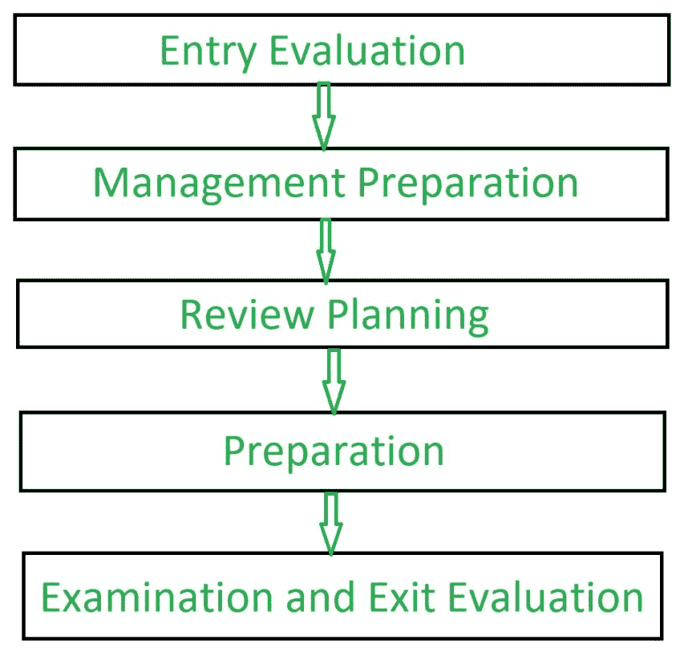

# 软件工程|软件评论

> 原文:[https://www . geesforgeks . org/software-engineering-software-review/](https://www.geeksforgeeks.org/software-engineering-software-review/)

**软件评审**是在软件开发生命周期(SDLC)的早期阶段，由一个或多个个人共同发现并解决软件中的错误和缺陷，从而对软件进行系统化的检查。软件评审是软件开发生命周期(SDLC)的重要组成部分，它帮助软件工程师验证软件的质量、功能和其他重要特性和组件。这是一个完整的过程，包括测试软件产品，并确保它符合客户提出的要求。

软件评审通常是手动进行的，用于验证各种文档，如需求、系统设计、代码、测试计划和测试用例。

**软件评审的目标:**
软件评审的目标是:

1.  提高开发团队的生产力。
2.  使测试过程时间和成本有效。
3.  让最终的软件缺陷更少。
4.  消除不足之处。

**软件评审流程:**

**软件评审类型:**
软件评审主要有 3 种类型:

1.  **Software Peer Review:**
    Peer review is the process of assessing the technical content and quality of the product and it is usually conducted by the author of the work product along with some other developers.
    Peer review is performed in order to examine or resolve the defects in the software, whose quality is also checked by other members of the team.

    同行评审有以下类型:

    *   **(i)代码审查:**
        系统地检查计算机源代码。
    *   **(ii)结对编程:**
        这是一个代码评审，两个开发人员在同一个平台上一起开发代码。
    *   **(iii)演练:**
        开发团队成员由 bu 作者和其他相关方指导，参与者就缺陷提出问题并做出评论。
    *   **(iv)技术审查:**
        一个由高度合格的个人组成的团队检查软件产品，以供其客户使用，并根据规范和标准识别技术缺陷。
    *   **(v)检验:**
        在检验中，评审者遵循明确的流程来发现缺陷。
2.  **Software Management Review:**
    Software Management Review evaluates the work status. In this section decisions regarding downstream activities are taken.
3.  **软件审核审查:**
    软件审核审查是一种外部审查，其中一个或多个不属于开发团队的批评者组织对软件产品及其过程的独立检查，以评估它们是否符合规定的规范和标准。这是由管理层人员完成的。

**软件评审优势:**

*   缺陷可以在开发的早期阶段被识别出来(尤其是在正式的评审中)。
*   更早的检查也降低了软件的维护成本。
*   可以用来培训技术作者。
*   它可以用来消除导致缺陷的过程缺陷。